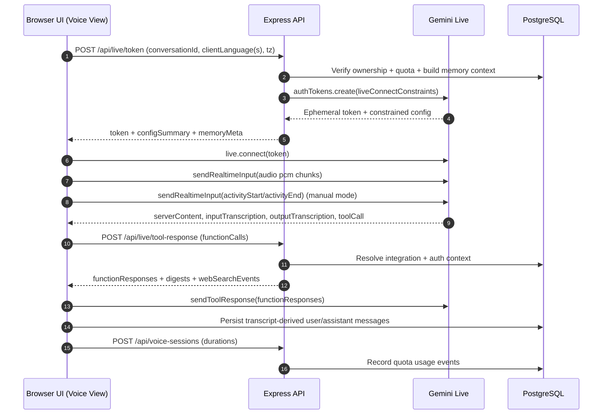
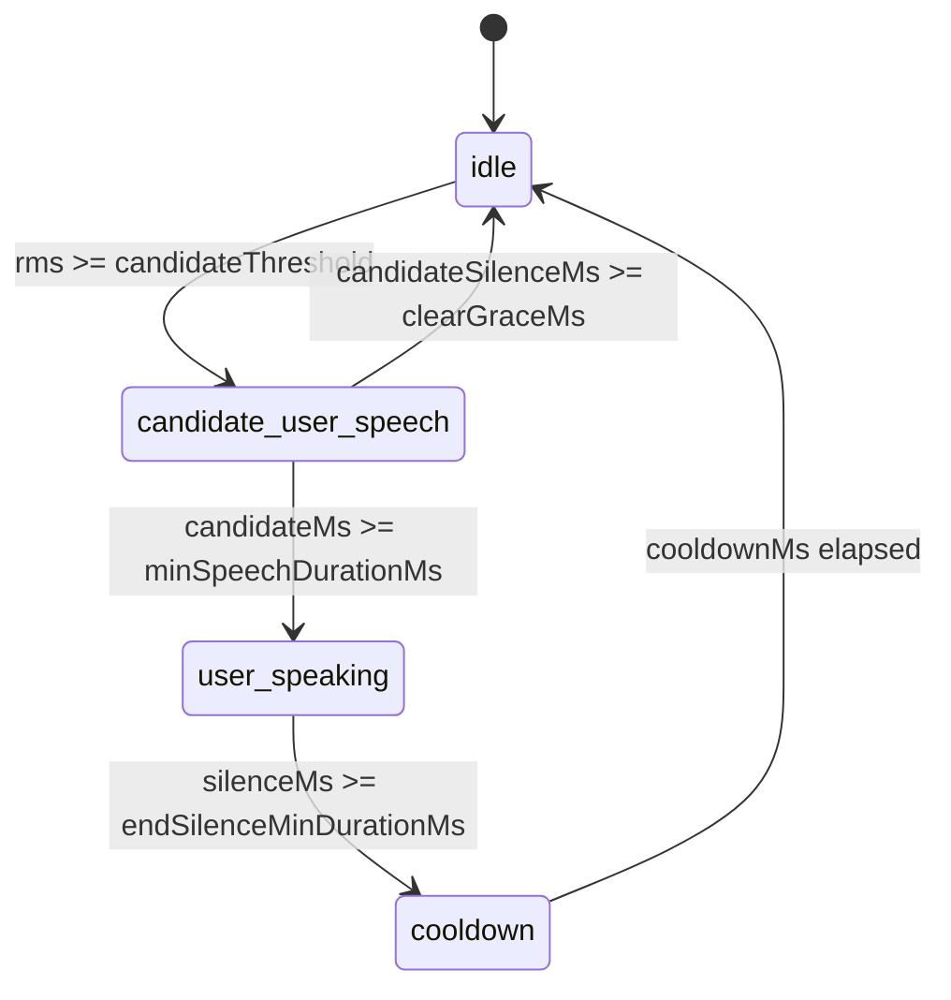

# ZeeMe — Multimodal AI Companion

A production-grade, mobile-first AI companion application with unified text and live voice modes sharing one persistent memory thread, image and camera support, user personalization, themeable dark UI, and comprehensive quota management.

**Live app:** [https://zeeme.replit.app](https://zeeme.replit.app)

---

## Table of Contents

1. [Product Overview](#1-product-overview)
2. [Core Architecture](#2-core-architecture)
3. [Tech Stack](#3-tech-stack)
4. [Repository Layout](#4-repository-layout)
5. [Data Model](#5-data-model-postgresql)
6. [API Surface](#6-api-surface)
7. [AI Integration](#7-ai-integration)
8. [Memory System](#8-memory-system)
9. [Theming and Design System](#9-theming-and-design-system)
10. [Quota Management](#10-quota-management)
11. [Security and Privacy](#11-security-and-privacy)
12. [Getting Started](#12-getting-started)
13. [Environment Variables](#13-environment-variables)
14. [Testing and QA](#14-testing-and-qa)
15. [Deployment](#15-deployment-replit--cloud-run-gateway)
16. [Troubleshooting](#16-troubleshooting)
17. [Contributor Workflow](#17-contributor-workflow)
18. [Design Principles](#18-design-principles)
19. [License](#19-license)

---

## 1) Product Overview

ZeeMe is a companion AI experience where users build a continuous relationship with Zee through natural conversation — by text, by voice, or by switching seamlessly between both.

### What users can do

- **Text chat** with Zee, including adaptive multi-part replies and lightweight markdown formatting (bold, italic, lists)
- **Live voice calls** with duplex-safe interruption control, real-time audio streaming, and transcript persistence
- **Share images** in text chat via camera capture or photo library upload
- **Share live camera** frames during voice sessions for visual context
- **Run Morning Brief (text mode)** for a concise, grounded digest of top headlines and market context
- **Query personal Google context** in both text and live voice, including inbox summaries, calendar overviews, detailed thread/event reads, and combined “emails + calendar” asks
- **Draft, revise, save, send, and delete Gmail drafts** through approval-gated Zee flows that persist into the shared conversation thread
- **Create and update Google Calendar events** through the same approval-gated task system used by Zee Stage
- **Use Zee Stage** to see the current Gmail/Calendar lookup, draft, event preview, ambiguity picker, or approval surface while voice is active or after the call ends
- **Personalize Zee** through profile settings, response style presets, and avatar customization
- **Switch between voice and text** while staying in one stitched conversation thread with shared memory
- **Customize appearance** with 4 color themes applied across the entire UI

### Recent platform additions (March 2026)

- **Google personal-context writes are now first-class**: Zee can prepare Gmail compose/reply/send flows and Calendar create/update flows in both text and live voice using approval-gated task cards and shared Google action context.
- **Zee Stage is now the canonical Google task surface**: the top “Open Zee Stage” chip can surface lookup summaries, ambiguity pickers, draft/event previews, and approval/result states across voice and text continuity.
- **Live mic capture is now aligned to a 16k PCM AudioWorklet pipeline**: browser mic audio is captured through a dedicated input worklet, emitted as raw PCM `audio/pcm;rate=16000`, and kept compatible with the existing Gemini Live payload contract.
- **Desktop/mobile capture profiles are more explicit**: desktop now prefers echo-cancelled mono tracks without `noiseSuppression` or `voiceIsolation`, while mobile keeps a more permissive `mobile_relaxed` speech profile and only falls back to heavier processing later.
- **Voice qualification is now a first-class release gate**: the repo includes capture smoke tests, trace regression audits, browser-profile fixtures, and a one-command local qualifier before Replit or live rollout.
- **Live tool-response handling is hardened**: `POST /api/live/tool-response` now sanitizes the full request envelope on both client and server, tolerates alias fields from Live tool calls, traces invalid requests, and safely retries once with a minimal payload when optional fields are rejected.
- **OAuth callback handling is environment-safe**: Google app sign-in and Google integration connect flow both use signed, TTL-bound OAuth state and support loopback-safe local testing on `127.0.0.1` and/or `localhost` when kept consistent per session.
- **Voice approval and follow-up policy is stricter**: Zee is explicitly instructed to treat short phrases like `send it`, `save it`, `I approve`, and `sounds good` as Google action follow-ups, and never claim a draft/event completed unless the tool result explicitly says it did.
- **Memory contamination hardening shipped**: Known "Google not connected" assistant fallbacks are filtered from memory context assembly to prevent stale operational phrasing from poisoning subsequent turns.
- **Voice status UX uses explicit process events**: voice path emits `webSearchEvents` (`searching`, `grounded`, `idle`) with intent-specific labels for lookup/read stages, while Zee Stage owns actionable draft/event/approval surfaces.
- **GCP Morning Brief reliability improved**: Cloud Run gateway remains optional but now participates in a clearer fallback contract (`brief_gcp_upstream_timeout` -> local grounded path with forensic breadcrumbs).

### Companion persona

- Runtime persona: **Zee** (server-authoritative, private system prompt)
- Voice options: `Aoede`, `Kore`, `Charon`, `Fenrir`
- Response styles: `concise`, `balanced`, `expressive`, `playful`

### Time and context awareness

ZeeMe uses a three-layer defense-in-depth system for accurate time/date reporting:

1. **System prompt** includes a calendar context block with current day, date, and time
2. **Text mode** injects a `[current_time: ...]` tag directly into the last user message in conversation contents
3. **Voice mode** injects a `[LIVE TIME ANCHOR]` at the top of the live memory context block

This ensures Zee always reports the correct current time even when conversation history contains older timestamps.

### Agentic creation features

The codebase includes a full agentic runtime for task execution, game generation, document/presentation/web-build creation, and sandbox isolation. This runtime is controlled by a **master gate flag**:

```
ENABLE_AGENTIC_CREATIONS=false    # Master server-side gate
VITE_ENABLE_AGENTIC_CREATIONS=false  # Master client-side gate
```

When the master gate is `false` (current default), all agentic routing — build offers, tasks, approvals, artifact cards — is blocked server-side and hidden from UI surfaces, regardless of individual sub-feature flags. The underlying runtime code, sub-feature flags (e.g., `ENABLE_AGENT_MODEL_GAME_GENERATOR`, `ENABLE_AGENT_MODEL_DOC_GENERATOR`, `ENABLE_AGENT_PROACTIVE_OFFERS`), and database tables remain intact. Setting `ENABLE_AGENTIC_CREATIONS=true` re-enables the full agentic experience with all configured sub-features.

---

## 2) Core Architecture

### High-level system map

```
+-------------------------------------+             +--------------------------------------+
| Browser App (React + Vite SPA)      |             | Google APIs                          |
|-------------------------------------|             |--------------------------------------|
| Text chat UI + stream renderer      |             | Gmail API (readonly)                 |
| Live voice/camera UI + Live WS      |             | Gmail API (compose/send)             |
| Zee Stage + Google task surfaces    |             | Calendar API (events.readonly/write) |
| Google connect + profile status     |             | Search grounding                     |
+----------------+--------------------+             +------------------+-------------------+
                 |                                                       ^
                 | HTTP/NDJSON/JSON                                      | OAuth token + API calls
                 v                                                       |
+----------------+-------------------------------------------------------+------------------+
| Express API (single origin server)                                                        |
|-------------------------------------------------------------------------------------------|
| auth/session  quota  memory context builder  chat orchestrator  live token mint          |
| google intent detect + context injection  google action/task executor  forensic tracing   |
+----------------------+----------------------------+--------------------+------------------+
                       |                            |                    |
                       | Drizzle ORM                | signed media URLs  | @google/genai
                       v                            v                    v
            +----------+---------------+   +--------+---------------+   +-------------------------------+
            | PostgreSQL               |   | Media Store            |   | Gemini API                    |
            | users/sessions           |   | Replit Object Storage  |   | text generateContent          |
            | conversations/messages   |   | local /tmp fallback    |   | live token + realtime WS      |
            | preferences/voice/memory |   +------------------------+   +-------------------------------+
            | quota + integrations     |
            +--------------------------+
                       |
                       | optional brief/news pipeline
                       v
            +-------------------------------+
            | Cloud Run Morning Brief       |
            | /v1/brief/news|inbox|compose  |
            +-------------------------------+
```

### Core request planes

| Plane | Primary Endpoint(s) | External Dependencies | Persisted State | Key Trace Anchors |
|---|---|---|---|---|
| Text chat | `POST /api/chat/respond/stream` | Gemini text model (+ optional Google Search grounding) | user + assistant messages, usage events | `chat.stream.*`, `google.context.*` |
| Live session bootstrap | `POST /api/live/token` | Gemini Live token API | usage prechecks, live memory build metadata | `live.token.*` |
| Live function resolution | `POST /api/live/tool-response` | Gmail/Calendar APIs, brief gateway, optional local brief fallback | read-path responses are ephemeral; write-path executions can create/update `agent_tasks`, `agent_steps`, `agent_approvals`, `agent_tool_calls`, and assistant UI messages | `live.tool.*`, `live.tool_response.*`, `google.action.*` |
| Google OAuth lifecycle | `GET /api/auth/google/start`, `GET /api/auth/google/callback`, `GET /api/integrations/google/connect-url`, `GET /api/integrations/google/callback`, `GET /api/integrations/google/status` | Google OAuth endpoints | session user state + encrypted integration token row (`google_integrations`) | `google.auth.*`, `google.integration.*` |
| Morning Brief orchestration | `POST /api/chat/respond*` + optional brief gateway calls | Cloud Run Brief gateway, Google Search grounding | brief cache entries + debug run history | `brief.*`, `google.context.*` |

### Runtime topology

```
Development:
  - One Node.js process runs Express + Vite middleware (HMR)
  - Client served from Vite dev server, API from same origin

Production:
  - Client built to dist/public (static assets)
  - Express serves static files + API from same origin
  - Autoscale deployment on Replit
  - Optional Cloud Run Morning Brief gateway behind `MORNING_BRIEF_GCP_BASE_URL`
```

### Text chat flow (streaming)

```
Client submits text/image
   -> POST /api/chat/respond/stream
      -> auth + conversation ownership checks
      -> quota gate (text_message)
      -> persist user message
      -> bind pending attachments
      -> inject current time context into conversation contents
      -> build model context window (history + memory + profile)
      -> evaluate web-search intent (explicit ask + freshness/topic heuristics)
      -> Gemini generateContentStream
      -> optional tools: [{ googleSearch: {} }]
      -> NDJSON event: web_search(searching/grounded) for UI status pills
      -> NDJSON events: ack -> delta* -> part_final* -> final
      -> persist assistant part messages (turnId + partIndex)
      -> sanitize split tokens from output
      -> async image memory summaries
```

### Live voice flow

```
Client starts voice call
  -> POST /api/live/token
     -> requires conversationId (ownership enforced)
     -> quota gate (voice remaining > 0)
     -> accepts optional browser language hints:
        - clientLanguage
        - clientLanguages[]
     -> build live memory context:
        - [LIVE TIME ANCHOR] with current timestamp
        - active thread turns (recent raw)
        - thread summary (compressed older turns)
        - cross-chat relevant turns
        - durable memory items
        - profile facts + style preferences
     -> compose system instruction with persona + memory
     -> language policy in prompt:
        - spoken-language continuity
        - english fallback when audio is unclear
        - transcript text treated as fallible
     -> optional tools:
        - googleSearch
        - get_user_emails / get_calendar_events (gate-controlled)
     -> create ephemeral Gemini Live token with constrained config
        - automaticActivityDetection.disabled=true
        - sessionResumption enabled
        - contextWindowCompression enabled
        - inputAudioTranscription enabled
        - outputAudioTranscription enabled
        - speechConfig.languageCode intentionally unset for native audio
  -> browser opens Gemini Live session via @google/genai
  -> getUserMedia capture profile selection:
       - desktop: prefer echo cancellation, avoid voiceIsolation/noiseSuppression
       - mobile: use relaxed speech profile, processed capture only as fallback
  -> dedicated input AudioWorklet:
       - capture at 16kHz target context
       - emit PCM16 chunks matching Gemini Live payload contract
       - keep ScriptProcessorNode only as fallback path
  -> mic PCM stream -> sendRealtimeInput(audio)
  -> optional camera frames -> sendRealtimeInput(video) @ ~1 FPS
  -> client-side speech detector state machine:
       idle -> candidate_user_speech -> user_speaking -> cooldown -> idle
     (with candidate hysteresis + clear-grace window)
  -> client sends manual activity signals:
       activityStart on detected speech / interrupt
       activityEnd on detected silence
  -> transcript-based search-intent detector can send grounding nudge
  -> model may emit function calls:
       - get_user_emails / get_calendar_events
       - get_email_thread_detail / get_calendar_event_detail
       - prepare_google_email_action / prepare_google_calendar_action
       - (optional) get_morning_brief / get_inbox_digest
  -> client forwards pending function calls to POST /api/live/tool-response
  -> server resolves tool calls (Google OAuth + fetch/prepare + guardrails)
  -> server returns:
       - functionResponses[]
       - resolvedFunctionCalls[]
       - chatDigests[] (optional human-readable digest)
       - webSearchEvents[] (searching/grounded/idle labels)
  -> client returns functionResponses back into Live session
  -> client updates lookup lane or Zee Stage surface:
       - lookup lane for read/search states
       - Zee Stage for ambiguity, clarification, preview, approval, running, result
  -> model audio playback + transcript capture
  -> user transcript persistence filter:
       - drop punctuation-only / low-signal fragments
       - retain valid speech for text-mode continuity
  -> transcript segments persisted to shared messages table
  -> POST /api/voice-sessions on end
     -> consume voice + camera seconds quotas
```

### Live voice reliability architecture (March 2026)





Current live voice reliability contract:

- Mic payload contract stays exactly `audio/pcm;rate=16000` with raw PCM chunks over Gemini Live.
- Desktop capture should prefer `echoCancellation=true`, `noiseSuppression=false`, and `voiceIsolation=false`; traces that show processed desktop tracks are considered regressions.
- Speech detection runs in two profiles:
  - `desktop_default`
  - `mobile_relaxed`
- Desktop adaptive thresholds are clamped so active/candidate thresholds do not collapse into the `0.001x` range.
- Transcript continuity remains enabled:
  - valid transcript rows persist into the shared `messages` table
  - persisted live transcript rows are tagged with `message_source=voice_transcript`
  - local-only `I couldn't catch that clearly` notices are diagnostic UI, not stored conversation history

### Google personal context flow (text + live voice)

```
Text query (e.g., "summarize my unread emails from last day")
  -> POST /api/chat/respond/stream
  -> detectGooglePersonalContextIntent
  -> resolve Google OAuth token + required scopes
  -> fetch Gmail digest and/or Calendar events
  -> build [GOOGLE PERSONAL DATA CONTEXT — LIVE FETCH RESULTS]
  -> inject context immediately before current user prompt
       (splice modelMessages[length-1, 0, contextBlock])
  -> if fetch fails, classify issue:
       - gmail_api_disabled / calendar_api_disabled
       - google_access_denied
       - google_timeout
  -> return targeted guardrail reply instead of generic fallback
  -> trace completion with:
       - emailFetchIssueKind + project number
       - calendarFetchIssueKind + project number

Voice path (server-gated, token-wired)
  -> POST /api/live/tool-response
  -> enforce mode gates:
       - ENABLE_GOOGLE_PERSONAL_CONTEXT
       - ENABLE_GOOGLE_PERSONAL_CONTEXT_VOICE
       - detail reads: ENABLE_GOOGLE_PERSONAL_CONTEXT_DETAIL_READS
       - write handoff: ENABLE_GOOGLE_PERSONAL_CONTEXT_WRITES + ENABLE_VOICE_GOOGLE_WRITE_HANDOFF
  -> resolve auth + scoped token per function call
  -> return functionResponses[] to active live session
  -> emit webSearchEvents + trace diagnostics for each tool leg
```

### Zee Stage and Google action lifecycle

Zee Stage is the shared Gmail/Calendar task canvas that sits above the conversation lane. It is deliberately separate from the lightweight lookup/status lane.

Two surface classes exist:

- **Lookup surface**: short-lived read/progress state such as `Checking your calendar`, `Retrieving email details`, or `Inbox and calendar ready`.
- **Zee Stage surface**: actionable or inspectable Gmail/Calendar UI such as:
  - Gmail compose session
  - Calendar clarification session
  - Email/calendar ambiguity picker
  - Approval-gated task preview
  - Completed Gmail draft/email send result
  - Completed Calendar create/update result

Candidate selection rules in the current client:

- The app derives stage candidates from the latest assistant UI payloads and unified task cards.
- Actionable candidates outrank passive ones.
- Pending approval outranks plain preview.
- Very old terminal surfaces are pruned.
- The most recent actionable surface becomes the default stage target unless the user manually pins another candidate.
- While voice is active, the top chip remains the canonical manual entry point (`Open Zee Stage`).
- After the voice session ends, the chip can still reopen the latest stage surface while idle.

Google action lifecycle:

```text
User asks Zee to draft/send email or create/update calendar event
  -> Gemini text/live prompt policy routes into prepare_google_email_action or prepare_google_calendar_action
  -> server resolves current Google conversation state:
       - pending task
       - compose session
       - calendar session
       - ambiguity candidates
       - recent actionable Gmail/Calendar tasks
       - optional client-provided googleActionContext from Zee Stage
  -> server decides one of:
       - clarify (missing title/time/body/recipient/etc.)
       - ambiguity_required
       - upgrade_required (not connected / missing write scopes)
       - ready (preview + approval gate)
       - completed / cancelled / revised
  -> assistant UI message persists the resulting preview/session/task
  -> Zee Stage surfaces that state immediately
  -> on explicit approval:
       - voice follow-up routes back through prepare tool
       - text/button approval routes through task approval endpoint
  -> server executes Gmail/Calendar write
  -> assistant UI message persists result
  -> Zee Stage moves from approval -> running -> completed/failed
```

Current stage surface types:

| Surface Type | Example | Backing payload/state |
|---|---|---|
| Lookup | `Checking your calendar...` | `webSearchEvents[]`, inferred lookup presentation |
| Compose session | Missing recipient/subject/body follow-up | `google_compose_session` UI payload |
| Calendar session | Missing event title or datetime | `google_calendar_session` UI payload |
| Ambiguity | `Which email did you mean?` | `google_action_ambiguity` UI payload |
| Task preview | Draft/event preview waiting for approval | unified `agent_task_status` card |
| Task result | `Draft saved`, `Email sent`, `Event created`, `Event updated` | unified `agent_task_status` card + `googleActionResult` |

---

## 3) Tech Stack

| Layer | Technology |
|---|---|
| Frontend | React 19, TypeScript, Vite, TanStack Query, Framer Motion, Tailwind CSS 4, Radix UI (shadcn/ui) |
| Backend | Express 5, TypeScript, Node.js 20 |
| Database | PostgreSQL 16 + Drizzle ORM + drizzle-kit |
| Auth | Custom email/password, bcrypt, express-session + connect-pg-simple |
| AI Models | `@google/genai` — Gemini text (Flash) + Gemini Live (native audio) |
| Media Storage | `@replit/object-storage` with local disk fallback |
| State Management | TanStack React Query (server state), React refs (local UI state) |
| Observability | Request trace IDs (`x-trace-id`) + structured redacted logging |
| Cloud Services | Google Cloud Run (Morning Brief gateway), Cloud Build, Secret Manager, Google Search grounding |
| Security | bcrypt password hashing, HMAC signed media URLs, secret scanning (local + CI) |

---

## 4) Repository Layout

```
.
├── client/
│   ├── src/
│   │   ├── App.tsx                        # Main app shell (Landing/Onboarding/Voice/Text/Profile views)
│   │   ├── main.tsx                       # React entry point
│   │   ├── components/
│   │   │   ├── OnboardingOrb.tsx          # Animated onboarding orb component
│   │   │   ├── artifacts/                 # Artifact viewer components (archived)
│   │   │   └── ui/                        # shadcn/ui component library
│   │   ├── hooks/
│   │   │   ├── use-auth.ts                # Auth state hook
│   │   │   └── use-toast.ts               # Toast notification hook
│   │   └── lib/
│   │       ├── gemini-live.ts             # Browser live voice/camera session client
│   │       ├── live-input-capture.worklet.js # AudioWorklet mic capture -> PCM16 path
│   │       ├── live-rms-processor.worklet.js # AudioWorklet RMS analysis for speech detection
│   │       ├── app-theme.ts               # Theme definitions (4 themes) + CSS variable application
│   │       ├── auth-utils.ts              # Client-side auth helpers
│   │       ├── queryClient.ts             # Fetch helpers + trace headers
│   │       └── utils.ts                   # Shared utility functions
│   ├── public/                            # Static assets
│   └── index.html                         # HTML entry with OG meta tags
├── server/
│   ├── index.ts                           # Express bootstrap + trace middleware
│   ├── routes.ts                          # API routes + chat orchestration + memory builder (~9800 lines)
│   ├── auth.ts                            # Session auth setup + middleware
│   ├── storage.ts                         # Drizzle persistence layer + quota accounting (~2100 lines)
│   ├── gemini.ts                          # Gemini text/live model integration + persona prompts (~2900 lines)
│   ├── agent-runtime.ts                   # Agentic task runtime (archived, ~6200 lines)
│   ├── agent-sandbox.ts                   # Sandbox job management (archived)
│   ├── artifact-render-spec.ts            # Artifact render spec builder (archived)
│   ├── media-store.ts                     # Replit Object Storage / local media drivers
│   ├── media-signing.ts                   # Signed media URL HMAC generation + validation
│   ├── observability.ts                   # Trace IDs, log redaction, structured forensic logging
│   ├── db.ts                              # PostgreSQL connection pool (Neon-backed)
│   ├── vite.ts                            # Vite dev server middleware
│   ├── static.ts                          # Production static file serving
│   └── replit_integrations/auth/          # Replit Auth integration (unused, custom auth active)
├── shared/
│   ├── schema.ts                          # Drizzle schema — all tables, enums, insert schemas, types
│   ├── live-audio-capture.ts             # Shared mic profile selection + threshold clamp helpers
│   ├── live-audio-compatibility.ts       # Browser/device audio compatibility + granted-track scoring
│   ├── agent.ts                           # Shared agent event/artifact types (archived features)
│   └── models/auth.ts                     # users + sessions table schema
├── docs/
│   ├── PROJECT_STATE.md                   # Canonical project state (resume any session here)
│   ├── SESSION_LOG.md                     # Chronological session handoff log
│   ├── AI_COMPANION_DESIGN_SPEC.md        # Original design spec + mockup reference
│   ├── GEMINI_INTEGRATION.md              # Gemini API integration details
│   ├── ZEE_STAGE_GOOGLE_ACTIONS.md        # Zee Stage + Gmail/Calendar read/write architecture
│   ├── MORNING_BRIEF_GCP_ROLLOUT.md       # Morning Brief Cloud Run + Gmail rollout runbook
│   ├── AGENTIC_ENGINEERING_GUIDE.md       # Full agentic feature engineering reference
│   ├── AGENTIC_ROADMAP_V1.md             # Agentic feature roadmap
│   ├── AGENT_MESSAGE_PURPOSE_BACKFILL.md  # Message purpose migration guide
│   ├── QUOTA_PRICING_REEVALUATION_2026-03-13.md  # Cost model worksheet
│   └── SKILLS_INDEX.md                    # Local skill pack index
├── services/
│   └── morning-brief-gcp/                 # Optional Cloud Run Morning Brief gateway
├── script/
│   ├── local-isolated-e2e.sh              # Isolated local integration tests
│   ├── check-secrets.sh                   # Secret scanning script
│   ├── dev-context.sh                     # Session context loader
│   ├── dev-handoff.sh                     # Session handoff helper
│   ├── live-audio-capture-smoke.ts        # PCM worklet / flush / chunk smoke tests
│   ├── live-trace-regression-smoke.ts     # Exported live-debug trace regression audit
│   ├── live-voice-browser-profile-smoke.ts # Desktop/iPhone/Android browser-profile fixture smoke
│   └── live-voice-qualify-local.sh        # One-command local voice qualification
├── .env.example                           # Safe placeholder env template
├── package.json                           # Dependencies + scripts
├── tsconfig.json                          # TypeScript config with path aliases
├── vite.config.ts                         # Vite build config
├── drizzle.config.ts                      # Drizzle Kit DB config
├── replit.md                              # Agent memory / project summary (Replit-specific)
└── zee-persona.md                         # Zee persona reference (private)
```

---

## 5) Data Model (PostgreSQL)

All tables are defined in `shared/schema.ts` and `shared/models/auth.ts`. Schema is managed via Drizzle Kit (`npm run db:push`).

### Core tables

| Table | Purpose |
|---|---|
| `users` | Account identity — email, hashed password, timestamps |
| `sessions` | express-session store (connect-pg-simple) |
| `conversations` | User-owned chat threads, persona label, timestamps |
| `messages` | Text + voice transcript entries. Supports multi-part assistant turns via `turnId` + `partIndex`. Includes `message_purpose` enum (`conversation`, `agent_ui`, `system`) for context filtering and `message_source` enum (`chat`, `voice_transcript`) so display cleanup can target persisted voice rows safely |
| `message_attachments` | Image attachments for text chat — lifecycle: `pending` -> `bound` -> `deleted`. Signed media retrieval |
| `user_preferences` | Selected voice, persona, theme, onboarding completion, memory mode, cross-chat memory toggle |
| `user_profiles` | Personalization fields — display name, bio, location, age, profession, gender, response style preset/note, Zee avatar preset/custom image refs, user avatar |
| `voice_sessions` | Voice call analytics — duration, camera duration, timestamps |
| `usage_events` | Rolling 30-day quota accounting by metric type |
| `google_integrations` | Encrypted Google OAuth token linkage for Gmail + Calendar reads, detail reads, and approval-gated write actions (draft save/send, calendar create/update) |
| `user_memory_items` | Durable semantic memory items extracted from conversation history, with embeddings and archive state |

### Quota metric types

- `text_message` — +1 per successful chat respond request
- `voice_second` — +duration at voice session save
- `camera_second` — +cameraDuration at voice session save
- `morning_brief_run` — +1 per uncached Morning Brief execution
- `gmail_digest_run` — +1 when Morning Brief runs inbox digest successfully
- `creation_run`, `coding_task`, `document_task`, `presentation_task`, `presentation_image` — agentic quotas (archived)

Current limitation:
- Gmail and Calendar reads/writes are still costed indirectly through text/live usage rather than first-class `usage_events` metrics. That is acceptable for the current beta, but the March 2026 quota re-evaluation recommends shadow-metering Google reads, detail reads, write preparation, write execution, and grounded search separately before wider rollout.

### Task, approval, and artifact tables

The same task runtime tables now back live Google action flows, Zee Stage previews, and broader gated agentic features.

| Table | Purpose |
|---|---|
| `agent_tasks` | Task lifecycle for Gmail drafts, Calendar actions, and gated agentic work — status, prompt, plan, errors |
| `agent_steps` | User-visible timeline for phases like `approval` and `execute` |
| `agent_approvals` | Pending/approved/denied approval records for irreversible Gmail/Calendar writes and other high-risk actions |
| `agent_tool_calls` | Execution audit log for the actual Gmail/Calendar or agent tool operation |
| `agent_artifacts` | Generated artifacts for broader agentic features (docs/web builds/etc.); schema remains active even when creation features are gated off |
| `agent_offers` | Offer-gated task suggestions for broader agentic creation flows |
| `agent_intent_sessions` | Slot-based clarification sessions for broader agentic work |

---

## 6) API Surface

All routes are same-origin under `/api/*`. Auth routes are public; all others require an active session.

### Authentication

| Method | Endpoint | Description |
|---|---|---|
| `POST` | `/api/auth/register` | Create account (email + password) |
| `POST` | `/api/auth/login` | Sign in |
| `GET` | `/api/auth/google/start` | Start Google SSO sign-in for the app session |
| `GET` | `/api/auth/google/callback` | Complete Google SSO sign-in and create app session |
| `GET` | `/api/auth/user` | Get current session user |
| `POST` | `/api/auth/logout` | Sign out |

### Conversations and Messages

| Method | Endpoint | Description |
|---|---|---|
| `GET` | `/api/conversations` | List user's conversations |
| `POST` | `/api/conversations` | Create new conversation |
| `GET` | `/api/conversations/:id/messages` | Get messages (paginated) |
| `POST` | `/api/conversations/:id/messages` | Post a message |
| `POST` | `/api/conversations/:id/voice-transcript` | Save voice transcript segment |

### Attachments and Media

| Method | Endpoint | Description |
|---|---|---|
| `POST` | `/api/conversations/:id/attachments/image` | Upload image attachment |
| `DELETE` | `/api/conversations/:id/attachments/:attachmentId` | Delete pending attachment |
| `GET` | `/api/media/:attachmentId` | Retrieve media (requires `exp` + `sig` query params) |

### Profile and Preferences

| Method | Endpoint | Description |
|---|---|---|
| `GET` | `/api/profile/me` | Get user profile |
| `PATCH` | `/api/profile/me` | Update profile fields |
| `POST` | `/api/profile/avatar` | Upload user avatar |
| `POST` | `/api/profile/zee-avatar` | Upload custom Zee avatar |
| `GET` | `/api/preferences` | Get user preferences |
| `PUT` | `/api/preferences` | Update preferences (voice, persona, theme) |
| `GET` | `/api/memory/settings` | Get memory mode settings |
| `PATCH` | `/api/memory/settings` | Update memory mode |
| `GET` | `/api/memory/items` | List durable memory items |
| `DELETE` | `/api/memory/items/:id` | Delete a memory item |

### AI and Live Voice

| Method | Endpoint | Description |
|---|---|---|
| `POST` | `/api/live/token` | Mint ephemeral Gemini Live session token |
| `POST` | `/api/live/tool-response` | Resolve Live function calls (Google personal context + optional Morning Brief tools) with traceable status events |
| `POST` | `/api/chat/respond` | Non-streaming text reply (legacy) |
| `POST` | `/api/chat/respond/stream` | Streaming text reply (NDJSON) |

### Live tool-response contract (`/api/live/tool-response`)

Request body (high-level):
- `conversationId`: owned conversation id
- `clientTimeZone`: optional IANA timezone
- `functionCalls[]`:
  - `id`
  - `name`
  - `args` (JSON object)
- `googleActionContext` (optional stage-selection hint):
  - `connector`
  - `action`
  - `actionableTargetId`
  - `candidateTargetIds[]`
  - `sourceTurnId`
  - `selectionReason`
  - `surfaceKey`
  - `selectionMode`

Compatibility notes:
- The browser client and server both sanitize minor envelope drift before validation.
- Alias fields such as `callId`, `functionCallId`, `functionName`, and `arguments` are normalized into the canonical request shape.
- If optional fields are rejected by an environment drift/build mismatch, the client retries once with a minimal payload (`conversationId` + `functionCalls` + optional timezone).

Supported function names:
- `get_user_emails`
- `get_calendar_events`
- `get_email_thread_detail`
- `get_calendar_event_detail`
- `prepare_google_email_action`
- `prepare_google_calendar_action`
- `get_morning_brief`
- `get_inbox_digest`

Response body (high-level):
- `functionResponses[]`: one entry per function call id/name with either `result` or `error`
- `resolvedFunctionCalls[]`: server mapping of requested function name to effective function name when reroutes occur
- `chatDigests[]`: optional assistant-safe digest text blocks for UI
- `webSearchEvents[]`: status telemetry used by lookup pills and Zee Stage lookup lane (`searching`, `grounded`, `idle`)

Google action response states used by `prepare_google_email_action` / `prepare_google_calendar_action`:
- `clarification_needed`
- `approval_required`
- `upgrade_required`
- `in_progress`
- `completed`
- `cancelled`

Common error codes from this endpoint:
- `google_personal_context_voice_disabled`
- `google_voice_write_handoff_disabled`
- `brief_live_disabled`
- `google_scope_missing`
- `google_token_refresh_failed`
- `google_not_connected`
- `google_fetch_failed`
- `gmail_api_disabled`
- `calendar_api_disabled`
- `google_access_denied`
- `google_timeout`
- `brief_quota_blocked`

Validation/observability notes:
- Invalid request envelopes return `400` with `traceId`.
- Server traces `live.tool_response.invalid_request` with failing Zod issue paths so bad payloads can be diagnosed from logs without guessing.

### Integrations and Diagnostics

| Method | Endpoint | Description |
|---|---|---|
| `GET` | `/api/integrations/google/connect-url` | Start Google OAuth (read-only Gmail + Calendar scopes) |
| `GET` | `/api/integrations/google/callback` | OAuth callback handler |
| `GET` | `/api/integrations/google/status` | Read integration status for current user |
| `POST` | `/api/integrations/google/disconnect` | Disconnect Google integration |
| `GET` | `/api/debug/brief-runs?limit=50` | Admin-only Morning Brief forensic run history |

### Usage and Quotas

| Method | Endpoint | Description |
|---|---|---|
| `GET` | `/api/quota/summary` | Get current quota usage + remaining |
| `POST` | `/api/voice-sessions` | Save voice session with duration |
| `GET` | `/api/voice-sessions` | List voice session history |

### Streaming event protocol (`/api/chat/respond/stream`)

The streaming endpoint emits newline-delimited JSON events:

| Event | Description |
|---|---|
| `ack` | Request accepted, echoes user message |
| `delta` | Incremental text chunk (includes `partIndex` for multi-part replies) |
| `part_final` | Client-renderable assistant bubble finalization |
| `final` | Canonical persisted assistant message(s), model name, token usage, elapsed time |
| `error` | Stream-level error payload |

---

## 7) AI Integration

### Models

| Purpose | Model | Notes |
|---|---|---|
| Text chat | `gemini-3-flash-preview` | Configurable via `GEMINI_TEXT_MODEL` |
| Live voice/video | `gemini-2.5-flash-native-audio-preview-12-2025` | Configurable via `GEMINI_LIVE_MODEL` |

### Persona and prompting

- Zee's persona instructions are **server-side only** and treated as private runtime configuration
- Public documentation intentionally avoids exposing raw system-prompt wording
- If the private persona source (`zee-persona.md`) is unavailable, the server falls back to a safe default prompt
- Additional runtime prompt blocks include:
  - Profile context (user-provided fields like name, bio, profession)
  - Response style preset instructions (`concise`, `balanced`, `expressive`, `playful`)
  - Human-texting cadence guidance for natural message pacing
  - Calendar/time context block for accurate temporal awareness
  - Grounding rules to prevent fabricated memory claims

### Grounding guardrail

A post-generation guardrail (`enforceGroundedReply`) checks for ungrounded memory signals and can trigger a rewrite pass. This keeps responses anchored to:
- Actual conversation history
- Explicit profile context provided by the user
- Verified durable memory items

### Multi-part reply splitting

Assistant responses can be split into multiple conversational bubbles for a natural texting feel. The splitting system:
- Uses a configurable split token (`ZEE_SPLIT_TOKEN`)
- Assigns each part a unique `partIndex` under the same `turnId`
- Includes defense-in-depth sanitization to prevent split markers from leaking into visible messages

### Google Search grounding

Both text and voice modes support real-time web search via Google Search grounding:

- **Text mode**: Automatically detects search-intent queries (news, scores, weather, prices, etc.) and injects `tools: [{ googleSearch: {} }]` into the generation request
- **Voice mode**: The ephemeral live token is created with Google Search tools baked into the session config. A client-side nudge mechanism detects search-intent in the user's live transcript and sends a `sendClientContent` instruction to activate grounding
- **UI indicator**: An animated pill with Google-colored dots shows "Searching the web…" during active search, transitioning to "Web-checked" with a globe icon when grounding completes. A minimum 1.4s display ensures the searching animation is visible
- **Fallback**: If token creation with grounding fails (API incompatibility), the system automatically falls back to a non-grounded session with a diagnostic warning logged

**Important**: The Live API's `lockAdditionalFields` is incompatible with `tools` configuration. When grounding is enabled, field locking is omitted from the token to avoid 400 errors.

### Web-search decision policy

When `GEMINI_TEXT_GOOGLE_SEARCH_AUTO_ONLY=true`, text grounding is selective and trigger-based:

- Direct asks such as "look up", "search", "google", "what happened", "did you see", "what do you think about X new release"
- Time-sensitive domains (news/headlines, sports results, weather, stocks/markets, leadership or product changes)
- Recency/freshness asks (`today`, `latest`, `current`, `this week`, `last` + event/topic)

Voice grounding uses a similar trigger policy based on finalized live user transcript chunks. If a trigger is detected, Zee emits the searching indicator and nudges the active Live session to ground the next answer.

### Google personal context (direct companion queries)

Supported intent classes:
- Unread/recency-filtered inbox asks (example: `can you summarize my unread emails from last day`)
- Calendar scheduling asks (example: `what do i have on my calendar today?`)
- Combined asks (example: `any key emails or events this week?`)
- Detailed read asks (example: `open the latest email from Maya`, `what changed in that invite?`)
- Gmail write asks (example: `draft an email to alex@example.com`, `send it`, `save it as a draft`, `reply and say Thursday works`)
- Calendar write asks (example: `create a lunch with Maya tomorrow at 2`, `move it to 4`, `add location Blue Bottle`)

Text-mode execution path:
1. Detect intent from the latest user prompt.
2. Resolve Google OAuth token with required scopes.
3. For read/detail asks, fetch Gmail/Calendar data immediately.
4. For write asks, route into the Google action task planner so Zee can create a preview, clarification session, or ambiguity card instead of improvising a fake success message.
5. Build a live context block that explicitly marks current fetch results or current Google task state as source of truth.
6. Insert that block immediately before the user’s current message in the model context window.
7. On failure, return targeted guardrail messaging from classified issue kinds.

Failure classification currently used in logs and guardrails:
- `gmail_api_disabled`
- `calendar_api_disabled`
- `google_access_denied`
- `google_timeout`

Voice-mode execution path:
- Model function calls are resolved through `POST /api/live/tool-response`.
- Read/detail tool set:
  - `get_user_emails`
  - `get_calendar_events`
  - `get_email_thread_detail`
  - `get_calendar_event_detail`
- Write/approval prep tool set:
  - `prepare_google_email_action`
  - `prepare_google_calendar_action`
- Server gate requires both:
  - `ENABLE_GOOGLE_PERSONAL_CONTEXT=true`
  - `ENABLE_GOOGLE_PERSONAL_CONTEXT_VOICE=true`
- Detail reads additionally require:
  - `ENABLE_GOOGLE_PERSONAL_CONTEXT_DETAIL_READS=true`
- Approval-gated voice write handoff additionally requires:
  - `ENABLE_GOOGLE_PERSONAL_CONTEXT_WRITES=true`
  - `ENABLE_VOICE_GOOGLE_WRITE_HANDOFF=true`
- Live token contains `configSummary.googlePersonalContextFunctionCallingEnabled`, which is used by the client to decide whether to wire Google personal-context function declarations for the session.
- If server gate is off, endpoint returns `google_personal_context_voice_disabled` with no partial execution.

Voice tool-resolution lane (runtime view):

```text
live transcript intent
  -> model emits functionCall(read/detail/prepare_google_* action)
    -> client: /api/live/tool-response
      -> auth + conversation ownership + feature gate checks
      -> resolve Google token + required scopes
      -> fetch Gmail/Calendar data or prepare Google action preview/session/task
      -> classify failures (api_disabled/access_denied/timeout/not_connected/missing_write_scopes)
      -> return { functionResponses, resolvedFunctionCalls, webSearchEvents, traceId }
    -> client sendToolResponse() back into Live session
      -> assistant continues with grounded personal context or approval-aware action follow-up
```

Context placement rationale:
- Prior behavior injected Google context at the start of message history, which could allow stale prior turns to dominate.
- Current behavior inserts context directly before the latest user request so fresh account data is temporally closest to the asked question.

Observability fields for incident triage:
- `emailFetchIssueKind`
- `emailFetchIssueProjectNumber`
- `calendarFetchIssueKind`
- `calendarFetchIssueProjectNumber`
- `live.tool.emails.*` / `live.tool.calendar.*` (server trace lifecycle)
- `live.tool.google_action.*` and `google.action.*` (write-path planning/execution)
- `live.tool_call.*` / `live.google_context.*` (client debug lifecycle)
- `live.tool_response.invalid_request` (server-side parse failure classification for bad live envelopes)

### Morning Brief (text mode first, voice-safe by default)

Morning Brief provides a single command-driven digest for:

- Top current news
- Market snapshot
- Optional Gmail inbox highlights (read-only)

Trigger policy:

- Explicit command: `give me my morning briefing`, `morning briefing`, `brief me`
- Greeting hint: `good morning` prompts a confirmation message instead of auto-running full brief

Reliability controls:

- Daily cap (`MORNING_BRIEF_DAILY_CAP`)
- 15-minute cache (`MORNING_BRIEF_CACHE_TTL_MS`)
- Explicit refresh policy (`MORNING_BRIEF_REQUIRE_EXPLICIT_REFRESH`)
- Partial-failure transparency (`brief_*` failure codes)
- Text-only safety lock (`ENABLE_MORNING_BRIEF_TEXT_ONLY=true` by default)

Current mode and rationale:

- Morning Brief execution is intentionally handled in text mode right now.
- Voice mode still supports grounded web search for normal conversational freshness.
- Live Morning Brief function calls are disabled by default to avoid coupling with voice session stability:
  - `ENABLE_MORNING_BRIEF_TEXT_ONLY=true`
  - `ENABLE_LIVE_FUNCTION_CALLING_BRIEF=false`
  - `VITE_ENABLE_MORNING_BRIEF_VOICE_MODE=false`

Cloud gateway behavior:

- If `MORNING_BRIEF_GCP_BASE_URL` is configured, server uses the Cloud Run gateway for news fetch and compose.
- If gateway is unavailable, server falls back to local grounded generation and records `brief_gcp_upstream_timeout`.

Execution contract (text mode):

1. Detect brief intent (`give me my morning briefing`, `brief me`, etc.).
2. Check cache and cap policy (cache hit returns immediately; cap applies only to uncached runs).
3. If uncached and configured, call gateway:
   - `POST /v1/brief/news`
   - optional `POST /v1/brief/inbox` (when Gmail is enabled + connected)
   - `POST /v1/brief/compose`
4. Normalize and render:
   - short conversational summary
   - structured "Morning Brief" card
5. Persist forensic metadata:
   - `traceId`
   - `briefRunId`
   - `partialFailures[]`

Operational guardrails:

- Admin/testing accounts can be exempted from the daily cap via `MORNING_BRIEF_CAP_EXEMPT_EMAILS`.
- `refresh morning brief` can bypass cache policy (depending on `MORNING_BRIEF_REQUIRE_EXPLICIT_REFRESH`).
- Brief runs never execute in live voice while `ENABLE_MORNING_BRIEF_TEXT_ONLY=true`.

### Live voice behavior

- Server issues **ephemeral live tokens** with constrained configuration baked in and returns `configSummary` for diagnostics.
- Live token setup hard-locks the realtime behavior:
  - `automaticActivityDetectionDisabled=true`
  - `sessionResumptionEnabled=true`
  - `contextWindowCompressionEnabled=true`
  - `effectiveInterruptMode=client_manual_activity`
  - `inputAudioTranscription` + `outputAudioTranscription` enabled
- Native audio language is auto-detected by provider path (`nativeAudioLanguageMode=auto_detect`); `speechConfig.languageCode` is intentionally not forced.
- Client sends optional language hints (`clientLanguage`, `clientLanguages`) to improve prompt policy and observability, not to hard-force recognition.
- Client streams mic audio as PCM and optional camera frames to Gemini Live.
- Client speech detector includes:
  - candidate hysteresis thresholding
  - candidate clear-grace window
  - spike-resistant ambient-floor estimation
  - assistant/idle threshold caps
- Voice prompt policy is explicitly tuned for casual speech:
  - interpret short, slang-heavy, or imperfect utterances charitably
  - use conversation context before asking the user to repeat
  - route approval-like follow-ups back into Google prepare tools instead of pretending actions completed
- Transcript pipeline includes script-family observability and mismatch events:
  - `live.transcript.received`
  - `live.transcript.language_mismatch_observed`
  - `live.audio.activity_window_transcription_received`
  - `live.audio.activity_window_no_input_transcription`
- Final validated transcript segments are persisted into the shared conversation `messages` table for text/voice continuity.
- Live memory context includes a time anchor, recent turns, compressed history, cross-chat context, and profile facts.
- Zee Stage can remain available after the voice session ends so the user can reopen the current Gmail/Calendar surface and finish approval or review work manually.

---

## 8) Memory System

ZeeMe implements a unified memory architecture where text and voice modes share a single conversation thread and memory context.

### Memory context builder

The memory context (used for both text model context and live voice system instructions) assembles these layers:

```
Layer 1: Live Time Anchor
  -> Current day, date, time, timezone
  -> Overrides any historical timestamps in conversation history

Layer 2: Active Thread Turns
  -> Recent raw conversation turns (configurable window)
  -> Both user and assistant messages

Layer 3: Thread Summary
  -> Compressed representation of older turns beyond the active window

Layer 4: Cross-Chat Context
  -> Relevant turns from other conversations by the same user
  -> Enabled via user preference (cross_chat_memory_enabled)

Layer 5: Durable Memory Items
  -> Extracted long-term facts: preferences, goals, profile details, relationships
  -> Categorized by kind: preference, goal, profile, project, fact, schedule, relationship
  -> Sensitivity levels: low, medium, high

Layer 6: Profile Facts
  -> User-provided profile fields (name, bio, profession, etc.)
  -> Response style preferences

Layer 7: Safe Selective Redaction
  -> High-sensitivity items can be excluded based on memory mode setting
```

### Memory modes

- **safe_selective** (default): Applies redaction rules to sensitive memory items
- **remember_everything**: All memory items included without redaction

### Message purpose filtering

Messages have a `message_purpose` field that controls whether they're included in model context:
- `conversation`: Normal chat messages (always included)
- `agent_ui`: Agentic UI messages like task cards (excluded from model context when `ENABLE_CONTEXT_MESSAGE_PURPOSE_FILTER=true`)
- `system`: System-generated messages

---

## 9) Theming and Design System

### Available themes

Themes are defined in `client/src/lib/app-theme.ts` and applied via CSS custom properties:

| Theme | Description |
|---|---|
| `classic_teal` | Original ZeeMe deep teal palette |
| `sunset_path` | Warm sunset-inspired tones |
| `violet_city` | Purple/violet urban palette |
| `crimson_noir` | Dark red/noir aesthetic |

### Theme variables

Each theme defines CSS variables covering:
- Shell, panel, header, footer backgrounds
- Accent colors and text contrast
- Message bubble colors (user vs assistant)
- Input field states
- Media tray and card surfaces
- Onboarding orb gradients

### Brand colors (classic_teal)

| Color | Hex | Usage |
|---|---|---|
| Deep Teal | `#10383A` | Primary backgrounds |
| Sage Green | `#809276` | Secondary accents |
| Olive | `#666E51` | Tertiary elements |
| Mustard Yellow | `#DAA112` | Primary accent / CTA |
| Gray | `#768886` | Neutral text/borders |

### Theme persistence

Theme selection is stored in `user_preferences.selectedTheme` and synced to the server. CSS variables are applied dynamically on theme change via `applyTheme()`.

---

## 10) Quota Management

### Overview

ZeeMe uses server-authoritative rolling 30-day hard limits to manage API cost exposure. Quotas are enforced at the route level before any model call.

### Default tier limits

| Metric | Default | Power | Privileged |
|---|---|---|---|
| Text replies | 600 | 1,500 | 5,000 |
| Voice seconds | 1,800 (30 min) | 5,400 (90 min) | 21,600 (6 hr) |
| Camera seconds | 900 (15 min) | 2,700 (45 min) | 21,600 (6 hr) |

### Tier assignment

- **Default**: All users unless matched by override lists
- **Power**: Email allowlist via `BETA_POWER_QUOTA_EMAILS`
- **Privileged**: Email allowlist via `BETA_PRIVILEGED_QUOTA_EMAILS`

### Enforcement behavior

- Hard lock on overage: `HTTP 429` with reason and quota summary for client UX
- Client shows remaining counters in the chat composer and profile
- Client proactively handles exhaustion states with clear messaging
- Quota cache TTL is configurable via `BETA_QUOTA_CACHE_TTL_MS` (default 5 minutes)

### Cost model (planning baseline — March 2026)

This section is the current planning envelope for ZeeMe's shipped quota controls, including the newer Gmail + Calendar flows.

Official source links:
- Gemini pricing: [ai.google.dev/gemini-api/docs/pricing](https://ai.google.dev/gemini-api/docs/pricing)
- Gemini token guidance: [ai.google.dev/gemini-api/docs/tokens](https://ai.google.dev/gemini-api/docs/tokens)
- Gmail API usage limits: [developers.google.com/workspace/gmail/api/reference/quota](https://developers.google.com/workspace/gmail/api/reference/quota)
- Calendar API quota guide: [developers.google.com/workspace/calendar/api/guides/quota](https://developers.google.com/workspace/calendar/api/guides/quota)
- Cloud Run pricing: [cloud.google.com/run/pricing](https://cloud.google.com/run/pricing)

Current ZeeMe-relevant price inputs:
- `gemini-3-flash-preview` text chat and Google-action planner:
  - input `~$0.50 / 1M tokens`
  - output `~$3.00 / 1M tokens`
- `gemini-2.5-flash-native-audio-preview-12-2025` live voice:
  - input audio/video `~$3.00 / 1M tokens`
  - output audio `~$12.00 / 1M tokens`
- `gemini-2.0-flash-lite` summarization/background utility:
  - input `~$0.075 / 1M tokens`
  - output `~$0.30 / 1M tokens`
- `gemini-embedding-001`:
  - input `~$0.15 / 1M tokens`
- Google Search grounding:
  - Gemini 3 models: `5,000` prompts/month free, then `~$14 / 1,000 search queries`
  - Gemini 2.5 models: `1,500` RPD free, then `~$35 / 1,000 grounded prompts`

Working assumptions used for planning:
- Text turn average: `2,500` input tokens + `350` output tokens
- Live audio estimate: `32` tokens/second in and `32` tokens/second out
- Camera estimate: `263` video tokens/second plus live audio in/out
- Morning Brief gateway: typically `1-3` grounded model calls per uncached run
- Gmail/Calendar reads are usually deterministic server fetches plus the user's normal reply turn
- Gmail/Calendar writes may add one or more extra Gemini planning/revision turns before the final API write

#### Unit-cost formulas

- `text_cost_per_msg = ((input_tokens * input_price_per_1M) + (output_tokens * output_price_per_1M)) / 1,000,000`
- `voice_cost_per_min = 60 * ((audio_in_tps * input_audio_price_per_1M) + (audio_out_tps * output_audio_price_per_1M)) / 1,000,000`
- `camera_cost_per_min = 60 * (((video_tps + audio_in_tps) * input_audio_video_price_per_1M) + (audio_out_tps * output_audio_price_per_1M)) / 1,000,000`

Using the assumptions above:
- text message: `~$0.0023`
- voice minute: `~$0.0288`
- camera minute: `~$0.0761`

Important accounting note:
- camera minutes are not additive on top of equal voice minutes; camera sessions already consume voice quota at the same time
- a realistic hard-ceiling model therefore uses `voice_only_minutes = max(voice_minutes - camera_minutes, 0)`

#### Gmail + Calendar cost implications

Google personal-context work adds two very different cost classes:

1. Gemini cost:
- Google-action routing (`prepare_google_email_action`, `prepare_google_calendar_action`)
- email draft generation and revision
- extra prompt/context tokens when Gmail or Calendar results are injected into text chat

2. Google API operational quota:
- Gmail is quota-unit based, not priced in ZeeMe's current billing model
- Calendar requests are available at no additional cost, but are still rate-limited per project/per user

What that means in practice:
- Gmail/Calendar reads are not major dollar drivers by themselves
- Gmail/Calendar writes are not expensive because of Google Workspace billing; they are heavier because they can trigger extra Gemini turns and approval loops
- live voice remains the dominant marginal cost driver once a user spends meaningful time in voice mode

Representative Google action footprints in the shipped code:

| Flow | Gemini overhead | Google API footprint | Operational note |
|---|---|---|---|
| Inbox summary read | usually tiny incremental token cost on top of the user's normal reply | Gmail `messages.list` + up to `messages.get` per returned thread | at default `10` threads, Zee can burn roughly `55` Gmail quota units |
| Email thread detail | small incremental token cost | Gmail search/list + `threads.get` | typical detail lookup is about `20` Gmail quota units |
| New email draft | `0-1` AI router call + `0-1` draft-writer call | optional Gmail `drafts.create` on save | Gmail draft create is `10` quota units |
| Send email | usually only approval parsing if draft already exists | Gmail `messages.send` or `drafts.send` | send operations are `100` Gmail quota units |
| Calendar summary read | usually tiny incremental token cost | one Calendar `events.list` request | no direct Calendar API billing |
| Calendar detail read | tiny incremental token cost | `events.list`/search + optional `events.get` | usually `1-2` Calendar requests |
| Calendar create/update | often deterministic parse, sometimes one small AI-router turn | `events.insert` or `events.get` + `events.update` | no direct Calendar API billing, but per-minute quotas still apply |

#### Quota-envelope estimates (current shipped quotas, base chat only)

These are hard-ceiling planning envelopes for the quotas currently enforced in code, using the overlap-aware live-session math above and excluding Morning Brief/search grounding.

| Tier | Approx. monthly cost per user (base chat only) |
|---|---|
| Default | `~$3.0` |
| Power | `~$8.2` |
| Privileged | `~$38.9` |

Detailed worksheet: `docs/QUOTA_PRICING_REEVALUATION_2026-03-13.md`

#### Morning Brief add-on estimates

Morning Brief is still one of the few features that can outspend plain chat quickly because Gemini 2.5 grounding is materially pricier than standard Flash text.

Grounding-only planning envelope:
- low run: `1` grounded call => `~$0.035`
- typical run: `2` grounded calls => `~$0.070`
- heavy run: `3` grounded calls => `~$0.105`

Per-user monthly Morning Brief add-on:
- `1 brief/day` (`~30 runs/month`): `~$1.1 - $3.2`
- at cap (`3 briefs/day`, `~90 runs/month`): `~$3.2 - $9.5`

Projected monthly total (`base chat + Morning Brief add-on`):

| Tier | With ~1 brief/day | With max 3 briefs/day |
|---|---|---|
| Default | `~$4.1 - $6.2` | `~$6.2 - $12.4` |
| Power | `~$9.3 - $11.4` | `~$11.4 - $17.6` |
| Privileged | `~$40.0 - $42.1` | `~$42.1 - $48.4` |

#### Recommended quota method

For the next product phase, the best fit is a hybrid model:

- Keep user-facing quotas simple:
  - text replies
  - voice minutes
  - camera minutes
  - Morning Brief runs
- Add internal shadow metrics for cost/risk-heavy operations:
  - `google_read`
  - `google_detail_read`
  - `google_write_prepare`
  - `google_write_execute`
  - `grounded_search_query`
  - optional background metrics like `memory_summary_block` and `memory_embedding_job`
- Use those shadow metrics for:
  - abuse/risk throttling
  - plan eligibility
  - margin analysis
  - alerting before a user becomes expensive

Why this is the recommended shape:
- users understand text/voice/camera much better than API-unit math
- Gmail/Calendar costs are mostly hidden Gemini-loop overhead plus operational quota pressure, not a clean user-facing dollar event
- search grounding and long voice sessions are much larger cost risks than a single draft save or event create

#### Suggested future user packages

These are recommended product packages, not the current hardcoded beta tiers:

| Package | User-facing limits (30d) | Suggested hidden guardrails | Planning ceiling |
|---|---|---|---|
| Starter | `600` texts, `20` voice min, `10` camera min, `30` Morning Briefs | `~150` Google reads, `~25` Google writes, `~50` grounded searches | `~$2.4` base, `~$3.5 - $5.6` with daily Morning Brief |
| Plus | `1,500` texts, `90` voice min, `30` camera min, `90` Morning Briefs | `~500` Google reads, `~100` Google writes, `~200` grounded searches | `~$7.5` base, `~$10.6 - $16.9` with daily Morning Brief |
| Power | `5,000` texts, `300` voice min, `90` camera min, `180` Morning Briefs | `~1,500` Google reads, `~300` Google writes, `~800` grounded searches | `~$24.4` base, `~$30.7 - $43.3` with daily Morning Brief |

Notes:
- These package suggestions intentionally trim camera time versus the current privileged beta tier because live video is now the steepest routine cost driver.
- Gmail/Calendar writes should usually spend hidden Google-action budget, not user-visible text quota alone.
- If you stay inside Google's free search-grounding allowance, actual spend can land materially below these envelopes.
- Cloud Run infra remains secondary at this scale; model/tool usage is the primary planning variable.

---

## 11) Security and Privacy

### Authentication

- Password hashing via **bcrypt** (10 salt rounds)
- HTTP-only session cookie (`connect.sid`)
- PostgreSQL-backed session store via `connect-pg-simple`
- All non-auth API routes require active session

### Media privacy

- Uploaded media is **private by default**
- Retrieval requires short-lived **signed URLs** (`exp` + `sig` query params)
- HMAC-SHA256 validation bound to requesting user
- `MEDIA_SIGNING_SECRET` must be set for production

### Observability and log hygiene

- Every request gets a trace ID (`x-trace-id` header)
- Structured log sanitization redacts:
  - API keys and secrets
  - Signature and query token patterns
  - Sensitive user data
- Forensic trace IDs link client requests to server-side log entries

### Secret scanning

| Command | Purpose |
|---|---|
| `npm run security:secrets` | Full repo secret scan |
| `npm run security:secrets:staged` | Staged files only |
| `npm run hooks:install` | Enable pre-commit secret scanning hook |

CI workflow (`.github/workflows/secret-scan.yml`) runs Gitleaks + local rules on PRs and pushes.

### File policies

- `.env` and `.env.*` are git-ignored
- `.env.example` contains only safe placeholder values
- `zee-persona.md` contains private persona text — never expose in public docs or logs

---

## 12) Getting Started

### Prerequisites

- Node.js 20+
- PostgreSQL 16+
- Gemini API key ([Google AI Studio](https://aistudio.google.com/))

### Quick start

```bash
# Install dependencies
npm install

# Set up environment
cp .env.example .env
# Edit .env: fill in DATABASE_URL, SESSION_SECRET, GEMINI_API_KEY

# Push database schema
npm run db:push

# Start development server
npm run dev
```

The app will be available at `http://127.0.0.1:5000` or `http://localhost:5000`, depending on your `HOST` setting.

Recommended local baseline:
- Use `.env.local.example` as the starting point for local Google + voice testing.
- Prefer `127.0.0.1` when `localhost:5000` is already occupied by another desktop service on your machine.
- Keep the browser host, OAuth redirect URIs, and callback env values on the **same loopback host** for a given session. Do not start on `127.0.0.1` and finish OAuth on `localhost`, or vice versa.

> `.env` safety rule: keep every entry as plain `KEY=value` only (no trailing shell commands on the same line).  
> Example: `DATABASE_URL=postgresql://postgres@127.0.0.1:5432/my_ai_companion_local`

### Google OAuth local + preview testing

Use this flow when validating app Google sign-in plus Gmail/Calendar integration in local dev and ephemeral preview hosts (for example Replit dev URLs):

1. Copy the committed local template and fill it in:
   - `cp .env.local.example .env.local`
   - The local dev server loads `.env` first, then `.env.local` as an override.
2. In Google Cloud Console, open the OAuth web client used for local ZeeMe testing and add the loopback host you actually plan to use. Common choices:
   - `http://127.0.0.1:5000/api/integrations/google/callback`
   - `http://127.0.0.1:5000/api/auth/google/callback`
   - or, if you truly use `localhost` instead:
   - `http://localhost:5000/api/integrations/google/callback`
   - `http://localhost:5000/api/auth/google/callback`
   - Optional phone/tunnel callback for Google integration: `https://<your-tunnel-host>/api/integrations/google/callback`
   - Optional phone/tunnel callback for app sign-in: `https://<your-tunnel-host>/api/auth/google/callback`
3. Set baseline OAuth env values in `.env.local`:
   - `GOOGLE_OAUTH_CLIENT_ID`
   - `GOOGLE_OAUTH_CLIENT_SECRET`
   - `GOOGLE_OAUTH_REDIRECT_URI=http://127.0.0.1:5000/api/integrations/google/callback` (or matching `localhost`)
   - `GOOGLE_OAUTH_AUTH_REDIRECT_URI=http://127.0.0.1:5000/api/auth/google/callback` (or matching `localhost`)
   - `GOOGLE_OAUTH_STATE_SIGNING_SECRET` (recommended; falls back to `SESSION_SECRET` when unset)
   - `GOOGLE_INTEGRATION_ENCRYPTION_KEY`
4. Start app with `npm run dev`.
5. Sign into the app first using Google or email/password.
6. Then request a connect URL:
   - `GET /api/integrations/google/connect-url`
7. Confirm response includes:
   - `redirectUri`
   - `redirectSource` (`query_override`, `dynamic_host`, or `configured_env`)
   - `state` is now signed and TTL-bound; callback no longer depends on in-memory cache persistence.
8. Complete OAuth and verify callback logs:
   - App auth: `google.auth.start`, `google.auth.callback.*`
   - Integration connect: `google.integration.callback.exchange_attempt`, `google.integration.callback.connected`

Local host consistency rule:
- App sign-in cookies are host-scoped.
- Google integration state is signed against the exact redirect URI.
- If you open the app on `127.0.0.1`, keep both app auth and integration callback URIs on `127.0.0.1`.
- If you open the app on `localhost`, keep both on `localhost`.
- Do not reuse stale callback tabs after changing hosts or restarting the server.

Write-flow local testing notes:
- Read-only Gmail/Calendar testing can use the default read scopes.
- Approval-gated Gmail/Calendar writes require:
  - Gmail compose/send scopes
  - Calendar events write scope
  - `ENABLE_GOOGLE_PERSONAL_CONTEXT_WRITES=true`
  - `ENABLE_VOICE_GOOGLE_WRITE_HANDOFF=true`
  - `VITE_ENABLE_GOOGLE_PERSONAL_CONTEXT_WRITES=true`
- The committed `.env.local.example` already shows the recommended local write-flow baseline.

After connecting Google locally, validate both auth layers separately:
- App auth callback: `/api/auth/google/callback`
- Google integration callback: `/api/integrations/google/callback`

Then validate both interaction surfaces:
- text-mode Gmail/Calendar asks
- live voice Gmail/Calendar reads and Zee Stage write flows

Common local failure pattern:
- `POST /api/live/tool-response 400`
  - usually means the frontend and backend disagree on the live tool-response payload shape or the deploy is stale
  - recent builds sanitize the whole envelope and trace `live.tool_response.invalid_request`

Optional (preview host override):
- Set `VITE_GOOGLE_OAUTH_CONNECT_REDIRECT_URI` to a full callback URL ending with `/api/integrations/google/callback`.
- This is useful for deterministic testing against a specific preview hostname without changing server default env.
- Keep this unset in production so live auth uses `GOOGLE_OAUTH_REDIRECT_URI`.

Local voice + Google recipe:
- Use the committed template at `.env.local.example` as the starting point for Gmail/Calendar voice testing.
- For read-only inbox/calendar testing, keep the default read-only `GOOGLE_OAUTH_SCOPES`.
- For approval-gated Gmail/Calendar write-flow testing, uncomment the write scopes and set `ENABLE_GOOGLE_PERSONAL_CONTEXT_WRITES=true`, `ENABLE_VOICE_GOOGLE_WRITE_HANDOFF=true`, and `VITE_ENABLE_GOOGLE_PERSONAL_CONTEXT_WRITES=true` so the client renders the same draft/task surfaces the server is allowed to produce.
- If you run standalone scripts instead of `npm run dev`, source the file first so those processes see local overrides:
  `set -a; source .env.local; set +a`

### Expo wrapper quick start (mobile shell)

```bash
# Install mobile wrapper dependencies
npm run mobile:install

# In terminal 1, run the web app backend+frontend
npm run dev

# In terminal 2, run Expo
npm run mobile:start
```

Set `mobile/.env` with:

```bash
EXPO_PUBLIC_WEB_APP_URL=http://localhost:5000
```

Use `http://10.0.2.2:5000` for Android emulator, and your LAN IP for physical devices.

### Available scripts

| Script | Purpose |
|---|---|
| `npm run dev` | Start dev server (Express + Vite HMR) |
| `npm run dev:quick` | Push schema then start dev server |
| `npm run dev:all` | Push schema, run typecheck + live voice checks, then start dev server |
| `npm run build` | Production build (client + server) |
| `npm run start` | Run production build |
| `npm run check` | TypeScript type checking |
| `npm run db:push` | Push Drizzle schema to database |
| `npm run dev:context` | Load session context (for AI-assisted development) |
| `npm run dev:handoff -- "summary"` | Create session handoff entry |
| `npm run security:secrets` | Full repository secret scan |
| `npm run security:secrets:staged` | Scan staged files for secrets |
| `npm run hooks:install` | Install pre-commit secret scanning hook |
| `npm run test:local:e2e` | Run isolated local integration tests |
| `npm run test:voice` | Full non-browser live voice regression suite |
| `npm run test:voice:capture` | Smoke-check AudioWorklet capture, PCM chunking, and flush behavior |
| `npm run test:voice:language` | Smoke-check language hint/script normalization |
| `npm run test:voice:trace` | Audit exported `live-debug-*.json` traces for known regressions |
| `npm run test:voice:transcript` | Smoke-check transcript display cleanup and voice transcript targeting |
| `npm run test:voice:mobile` | Smoke-check mobile compatibility + speech profile defaults |
| `npm run test:voice:profiles` | Run desktop/iPhone/Android browser-profile fixture matrix |
| `npm run test:voice:qualify:local` | Run the full local live voice qualification sequence |
| `npm run mobile:install` | Install dependencies for Expo wrapper (`mobile/`) |
| `npm run mobile:start` | Start Expo dev server |
| `npm run mobile:ios` | Run iOS native build via Expo |
| `npm run mobile:android` | Run Android native build via Expo |
| `npm run mobile:web` | Run Expo web target |

---

## 13) Environment Variables

Source of truth: `.env.example`

Operational note:
- `replit.env` is a local operator reference only. It is gitignored and must never become the source of truth over `.env.example`, deployed secrets, or exported live-debug traces.

### Required

| Variable | Description |
|---|---|
| `DATABASE_URL` | PostgreSQL connection string |
| `SESSION_SECRET` | Express session signing secret |
| `GEMINI_API_KEY` | Google Gemini API key |

### Model selection

| Variable | Default | Description |
|---|---|---|
| `GEMINI_TEXT_MODEL` | `gemini-3-flash-preview` | Text chat model |
| `GEMINI_LIVE_MODEL` | `gemini-2.5-flash-native-audio-preview-12-2025` | Live voice model |
| `GEMINI_LIVE_MODEL_FALLBACKS` | — | Comma-separated fallback models |

### Text generation tuning

| Variable | Default | Description |
|---|---|---|
| `GEMINI_TEXT_TEMPERATURE` | `0.85` | Sampling temperature |
| `GEMINI_TEXT_TOP_P` | `0.95` | Top-p sampling |
| `GEMINI_TEXT_MAX_OUTPUT_TOKENS` | `2048` | Max output tokens per reply |
| `GEMINI_TEXT_MEMORY_WINDOW_MESSAGES` | `40` | Messages included in context window |

### Google Search grounding

| Variable | Default | Description |
|---|---|---|
| `ENABLE_GEMINI_TEXT_GOOGLE_SEARCH_GROUNDING` | `true` | Enable Google Search grounding support for text replies |
| `GEMINI_TEXT_GOOGLE_SEARCH_AUTO_ONLY` | `true` | If `true`, use grounding only on search-intent/freshness queries; if `false`, ground all text replies |
| `ENABLE_GEMINI_LIVE_GOOGLE_SEARCH_GROUNDING` | `true` | Enable Google Search tools in live voice sessions |

### Morning Brief controls

| Variable | Default | Description |
|---|---|---|
| `ENABLE_MORNING_BRIEF` | `true` | Master feature flag for Morning Brief orchestration |
| `ENABLE_GMAIL_INBOX_DIGEST` | `false` | Enable read-only inbox digest section |
| `ENABLE_MORNING_BRIEF_TEXT_ONLY` | `true` | Hard-lock Morning Brief execution to text mode |
| `ENABLE_LIVE_FUNCTION_CALLING_BRIEF` | `false` | Optional Live function-calling path (keep `false` for voice stability) |
| `MORNING_BRIEF_DAILY_CAP` | `3` | Max brief runs per user per local day (cache hits excluded) |
| `MORNING_BRIEF_CACHE_TTL_MS` | `900000` | Brief cache TTL (15 minutes) |
| `MORNING_BRIEF_MAX_NEWS_ITEMS` | `5` | Max number of news headlines returned |
| `MORNING_BRIEF_MAX_INBOX_THREADS` | `10` | Max Gmail threads summarized |
| `MORNING_BRIEF_REQUIRE_EXPLICIT_REFRESH` | `true` | Require explicit `refresh morning brief` to bypass cache |
| `MORNING_BRIEF_GCP_BASE_URL` | — | Cloud Run Morning Brief gateway base URL |
| `MORNING_BRIEF_GCP_TIMEOUT_MS` | `65000` | Gateway request timeout (covers Cloud Run cold-start + grounding latency) |
| `MORNING_BRIEF_RSS_TIMEOUT_MS` | `8000` | RSS fallback fetch timeout used when grounding/gateway coverage is weak |
| `MORNING_BRIEF_CAP_EXEMPT_EMAILS` | — | Comma-separated emails exempt from Morning Brief daily cap (admin/testing) |
| `MORNING_BRIEF_DEBUG_HISTORY_LIMIT` | `200` | In-memory debug run history cap |

### Google OAuth integration

| Variable | Default | Description |
|---|---|---|
| `GOOGLE_OAUTH_CLIENT_ID` | — | OAuth client ID for Gmail connector |
| `GOOGLE_OAUTH_CLIENT_SECRET` | — | OAuth client secret |
| `GOOGLE_OAUTH_AUTH_REDIRECT_URI` | — | Optional dedicated callback URI for app Google SSO (`/api/auth/google/callback`) |
| `GOOGLE_AUTH_POST_LOGIN_REDIRECT` | `/` | Optional post-login redirect path after app Google SSO completes |
| `GOOGLE_OAUTH_REDIRECT_URI` | — | Canonical OAuth callback URI (production recommended: `https://zeeme.io/api/integrations/google/callback`) |
| `GOOGLE_OAUTH_SCOPES` | `openid,email,profile,https://www.googleapis.com/auth/gmail.readonly,https://www.googleapis.com/auth/calendar.events.readonly` | Scopes for Google integration. Add `gmail.compose`, `gmail.send`, and `calendar.events` when testing approval-gated write flows |
| `GOOGLE_OAUTH_STATE_SIGNING_SECRET` | — | Optional dedicated HMAC secret for signed OAuth state tokens (falls back to `SESSION_SECRET`) |
| `ENABLE_GOOGLE_OAUTH_DYNAMIC_CALLBACK_HOST` | `true` in non-production, `false` in production | Allow callback host switching to current request host when it differs from configured redirect URI host |
| `ENABLE_GOOGLE_OAUTH_REDIRECT_URI_OVERRIDE` | `true` in non-production, `false` in production | Allow `redirectUri` query overrides on `/api/integrations/google/connect-url` |
| `GOOGLE_INTEGRATION_ENCRYPTION_KEY` | — | AES-GCM key for encrypted token storage |

OAuth callback resolution order (`GET /api/integrations/google/connect-url`):
1. `redirectUri` query param (if provided, valid callback path, and `ENABLE_GOOGLE_OAUTH_REDIRECT_URI_OVERRIDE=true`)
2. `GOOGLE_OAUTH_REDIRECT_URI` (configured default; always used when host matches, or when dynamic host switching is disabled)
3. Dynamic host callback (`https://<request-host>/api/integrations/google/callback`) only when host differs and `ENABLE_GOOGLE_OAUTH_DYNAMIC_CALLBACK_HOST=true`

The selected callback is returned in API response as `redirectUri` + `redirectSource`, and encoded into signed OAuth `state` so callback token exchange uses the exact same URI across reloads/restarts.

### Google personal context controls

| Variable | Default | Description |
|---|---|---|
| `ENABLE_GOOGLE_PERSONAL_CONTEXT` | `true` | Master flag for Google personal-context features |
| `ENABLE_GOOGLE_PERSONAL_CONTEXT_TEXT` | `true` | Enable personal-context injection/guardrails in text mode |
| `ENABLE_GOOGLE_PERSONAL_CONTEXT_VOICE` | `false` | Recommended explicit server runtime gate. Note: code fallback is `true` when unset, so set this value in every environment for deterministic behavior |
| `ENABLE_GOOGLE_PERSONAL_CONTEXT_DETAIL_READS` | `false` | Enable detail-read tools such as `get_email_thread_detail` and `get_calendar_event_detail` |
| `ENABLE_GOOGLE_PERSONAL_CONTEXT_WRITES` | `false` | Enable approval-gated Gmail/Calendar write preparation on the server |
| `ENABLE_VOICE_GOOGLE_WRITE_HANDOFF` | `false` | Allow live voice tool-response path to hand Gmail/Calendar write prep back into Zee Stage/task surfaces |
| `VITE_ENABLE_GOOGLE_PERSONAL_CONTEXT_VOICE` | `false` | Legacy client diagnostic flag retained for telemetry visibility; does not authorize server fetches or override token/server gates |
| `VITE_ENABLE_GOOGLE_PERSONAL_CONTEXT_WRITES` | `false` | Client UI gate for Gmail/Calendar write surfaces such as draft/event cards and Zee Stage editing affordances |

Precedence notes:
- Server endpoint behavior (`/api/live/tool-response`) is controlled by server runtime env values.
- Live session function wiring is controlled by `configSummary.googlePersonalContextFunctionCallingEnabled` returned from `POST /api/live/token`.
- `VITE_ENABLE_GOOGLE_PERSONAL_CONTEXT_VOICE` is not a hard authorization gate and should not be used as a security/control mechanism.
- `VITE_ENABLE_GOOGLE_PERSONAL_CONTEXT_WRITES` controls whether the client renders the write/task surfaces; it does not grant backend write access by itself.
- Voice Gmail/Calendar write behavior requires **all** of the following to be aligned:
  - OAuth scopes include the required Gmail/Calendar write scopes
  - `ENABLE_GOOGLE_PERSONAL_CONTEXT=true`
  - `ENABLE_GOOGLE_PERSONAL_CONTEXT_VOICE=true`
  - `ENABLE_GOOGLE_PERSONAL_CONTEXT_WRITES=true`
  - `ENABLE_VOICE_GOOGLE_WRITE_HANDOFF=true`
  - `VITE_ENABLE_GOOGLE_PERSONAL_CONTEXT_WRITES=true`

### Live voice / VAD configuration

| Variable | Default | Description |
|---|---|---|
| `GEMINI_LIVE_ACTIVITY_HANDLING` | `START_OF_ACTIVITY_INTERRUPTS` | Desired interruption behavior flag (current server runtime enforces `START_OF_ACTIVITY_INTERRUPTS`) |
| `GEMINI_LIVE_LOW_LATENCY_MODE` | `true` | Low latency audio mode |
| `GEMINI_LIVE_VAD_START_SENSITIVITY` | `LOW` | VAD start sensitivity |
| `GEMINI_LIVE_VAD_END_SENSITIVITY` | `HIGH` | VAD end sensitivity |
| `GEMINI_LIVE_VAD_PREFIX_PADDING_MS` | `60` | VAD prefix padding |
| `GEMINI_LIVE_VAD_SILENCE_MS` | `220` | VAD silence threshold |
| `GEMINI_LIVE_MIN_VAD_PREFIX_PADDING_MS` | `50` | Minimum enforced VAD prefix padding in token setup |
| `GEMINI_LIVE_MIN_VAD_SILENCE_MS` | `180` | Minimum enforced VAD silence in token setup |
| `GEMINI_LIVE_TURN_COVERAGE` | `TURN_INCLUDES_ONLY_ACTIVITY` | Turn coverage mode for realtime input |
| `GEMINI_LIVE_ENABLE_AFFECTIVE_DIALOG` | `true` | Enables affective dialog in audio mode |
| `GEMINI_LIVE_PROACTIVE_AUDIO` | `false` | Proactive audio generation |
| `GEMINI_LIVE_FORCE_ALWAYS_RESPOND` | `true` | When `true`, prevents proactive silent skips |
| `GEMINI_LIVE_ALLOW_ZERO_THINKING_BUDGET` | `false` | Allows zero thinking budget only when explicitly enabled |
| `GEMINI_LIVE_TEMPERATURE` | `0.45` | Live model temperature |
| `GEMINI_LIVE_TOP_P` | `0.85` | Live nucleus sampling |
| `GEMINI_LIVE_TOP_K` | `24` | Live top-k sampling |
| `GEMINI_LIVE_MAX_OUTPUT_TOKENS` | `1000` | Max live output tokens |
| `GEMINI_LIVE_USE_THINKING_CONFIG` | `true` | Enable thinking tokens |
| `GEMINI_LIVE_MIN_THINKING_BUDGET` | `128` | Minimum enforced thinking budget when zero is disallowed |
| `GEMINI_LIVE_THINKING_BUDGET` | `128` (effective floor) | Requested thinking budget (enforced to at least min budget unless zero allowed) |
| `GEMINI_LIVE_INCLUDE_THOUGHTS` | `false` | Include thought text in responses (usually keep disabled) |
| `ENABLE_GEMINI_LIVE_GOOGLE_SEARCH_GROUNDING` | `true` | Enables live grounding attempt with fallback to non-grounded token when unsupported |

### Client live audio capture (`VITE_*` — build-time)

| Variable | Default | Description |
|---|---|---|
| `VITE_ENABLE_MORNING_BRIEF_VOICE_MODE` | `false` | Client guardrail for optional Live Morning Brief function loop |
| `VITE_GOOGLE_OAUTH_CONNECT_REDIRECT_URI` | — | Optional dev-only callback override sent to `/api/integrations/google/connect-url` (must end with `/api/integrations/google/callback`) |
| `VITE_LIVE_AUDIO_PROCESSOR_BUFFER_SIZE` | `512` | Output chunk sample count used by the AudioWorklet capture path (and ScriptProcessor fallback) before PCM encoding |
| `VITE_LIVE_AUDIO_NOISE_GATE_ENABLED` | `false` | Client-side noise gate |
| `VITE_LIVE_AUDIO_NOISE_GATE_RMS_THRESHOLD` | `0.006` | Base RMS floor for noise gate |
| `VITE_LIVE_AUDIO_NOISE_GATE_HANGOVER_FRAMES` | `3` | Gate hangover frames after speech |
| `VITE_LIVE_AUDIO_NOISE_GATE_FAILOPEN_ENABLED` | `false` | Fail-open mode when too many drops occur |
| `VITE_LIVE_AUDIO_NOISE_GATE_ASSISTANT_SPEECH_MULTIPLIER` | `1.45` | Raises noise gate threshold during assistant speech |
| `VITE_LIVE_AUDIO_NOISE_GATE_FAILOPEN_AFTER_DROPS` | `120` | Consecutive drop count before fail-open |
| `VITE_LIVE_AUDIO_NOISE_GATE_FAILOPEN_FRAMES` | `60` | Frames to stay fail-open |
| `VITE_LIVE_AUDIO_SUPPRESS_INPUT_WHILE_ASSISTANT_SPEAKING` | `true` | Duplex suppression |
| `VITE_LIVE_AUDIO_SUPPRESS_INPUT_COOLDOWN_MS` | `240` | Suppression cooldown |
| `VITE_LIVE_AUDIO_SUPPRESS_USER_TRANSCRIPT_DURING_ASSISTANT_SPEECH` | `true` | Drop user transcript capture while assistant speaking (unless manual activity active) |
| `VITE_LIVE_AUDIO_BARGE_IN_RMS_THRESHOLD` | `0.02` | RMS threshold for assistant interruption/barge-in |
| `VITE_LIVE_AUDIO_BARGE_IN_CONSECUTIVE_FRAMES` | `5` | Consecutive frames required for barge-in |
| `VITE_LIVE_AUDIO_BARGE_IN_AMBIENT_MULTIPLIER` | `2.2` | Ambient multiplier for barge-in threshold |
| `VITE_LIVE_AUDIO_BARGE_IN_MAX_RMS_THRESHOLD` | `0.045` | Max cap for barge-in threshold |
| `VITE_LIVE_AUDIO_ASSISTANT_IDLE_RELEASE_USER_SPEECH_RMS_THRESHOLD` | `0.007` | User speech RMS to release stalled assistant window |
| `VITE_LIVE_AUDIO_ASSISTANT_IDLE_RELEASE_AMBIENT_MULTIPLIER` | `1.2` | Ambient multiplier for idle release speech test |
| `VITE_LIVE_AUDIO_USER_SPEECH_RMS_THRESHOLD` | `0.008` | Base RMS threshold for user speech start |
| `VITE_LIVE_AUDIO_USER_SPEECH_AMBIENT_MULTIPLIER` | `1.6` | Ambient multiplier while assistant is not speaking |
| `VITE_LIVE_AUDIO_USER_SPEECH_ASSISTANT_AMBIENT_MULTIPLIER` | `2.2` | Ambient multiplier while assistant is speaking |
| `VITE_LIVE_AUDIO_USER_SPEECH_ASSISTANT_MAX_RMS_THRESHOLD` | `0.04` | Max speech threshold during assistant speech |
| `VITE_LIVE_AUDIO_USER_SPEECH_IDLE_MAX_RMS_THRESHOLD` | `0.024` | Max speech threshold while idle |
| `VITE_LIVE_AUDIO_USER_SPEECH_CANDIDATE_HYSTERESIS_MULTIPLIER` | `0.66` | Lowers threshold after candidate starts |
| `VITE_LIVE_AUDIO_USER_SPEECH_CANDIDATE_MIN_RMS_THRESHOLD` | `0.0055` | Floor for candidate threshold |
| `VITE_LIVE_AUDIO_USER_SPEECH_CANDIDATE_CLEAR_SILENCE_MS` | `48` | Silence grace before candidate resets |
| `VITE_LIVE_AUDIO_USER_SPEECH_AMBIENT_FLOOR_RISE_SMOOTHING` | `0.02` | Ambient floor smoothing when rising |
| `VITE_LIVE_AUDIO_USER_SPEECH_AMBIENT_FLOOR_FALL_SMOOTHING` | `0.12` | Ambient floor smoothing when falling |
| `VITE_LIVE_AUDIO_USER_SPEECH_AMBIENT_FLOOR_SPEECH_SPIKE_GUARD` | `1.35` | Prevents speech spikes from inflating ambient floor |
| `VITE_LIVE_AUDIO_USER_SPEECH_START_CONSECUTIVE_FRAMES` | `3` | Frames required before user speech starts |
| `VITE_LIVE_AUDIO_USER_SPEECH_ASSISTANT_CONSECUTIVE_FRAMES` | `5` | Frames required while assistant is speaking |
| `VITE_LIVE_AUDIO_USER_SPEECH_END_SILENCE_FRAMES` | `18` | Silence frames before ending user speech |
| `VITE_LIVE_AUDIO_USER_SPEECH_COOLDOWN_MS` | `220` | Cooldown before returning to idle |
| `VITE_LIVE_AUDIO_MANUAL_INTERRUPT_IDLE_TIMEOUT_MS` | `1400` | Timeout for manual interrupt watchdog |
| `VITE_LIVE_AUDIO_TRANSCRIPT_EXPECTATION_TIMEOUT_MS` | `2200` | Time window for transcript arrival after speech window ends |
| `VITE_LIVE_ANDROID_LEGACY_MAX_MAJOR` | `10` | Android major-version cutoff for legacy timeout profile |
| `VITE_LIVE_AUDIO_MOBILE_THRESHOLD_SCALE` | `0.84` | Mobile-only multiplier to reduce user speech threshold pressure |
| `VITE_LIVE_AUDIO_MOBILE_ASSISTANT_THRESHOLD_SCALE` | `0.88` | Mobile-only multiplier for user threshold while assistant window is active |
| `VITE_LIVE_AUDIO_MOBILE_AMBIENT_MULTIPLIER_SCALE` | `0.82` | Mobile-only scale for ambient threshold multipliers |
| `VITE_LIVE_AUDIO_MOBILE_IDLE_MAX_RMS_CAP` | `0.02` | Mobile-only cap for idle speech threshold |
| `VITE_LIVE_AUDIO_MOBILE_ASSISTANT_MAX_RMS_CAP` | `0.03` | Mobile-only cap for speech threshold during assistant window |
| `VITE_LIVE_AUDIO_MOBILE_START_MIN_DURATION_MULTIPLIER` | `0.85` | Mobile-only multiplier for minimum detected speech duration (idle) |
| `VITE_LIVE_AUDIO_MOBILE_ASSISTANT_MIN_DURATION_MULTIPLIER` | `0.88` | Mobile-only multiplier for minimum detected speech duration (assistant window) |
| `VITE_LIVE_AUDIO_MOBILE_END_SILENCE_MULTIPLIER` | `1.35` | Mobile-only multiplier for end-of-speech silence window |
| `VITE_LIVE_AUDIO_MOBILE_CANDIDATE_CLEAR_MULTIPLIER` | `2.1` | Mobile-only multiplier for candidate clear-grace silence |
| `VITE_LIVE_AUDIO_MOBILE_MIN_CANDIDATE_CLEAR_MS` | `96` | Hard floor for mobile candidate clear-grace duration |
| `VITE_LIVE_AUDIO_MOBILE_MIN_END_SILENCE_MS` | `760` | Hard floor for mobile end-of-speech silence duration |
| `VITE_LIVE_AUDIO_MOBILE_ASSISTANT_BARGE_IN_MIN_DURATION_MS` | `320` | Mobile-only minimum candidate duration before auto-barge-in while assistant is speaking |
| `VITE_LIVE_AUDIO_MOBILE_ASSISTANT_BARGE_IN_MIN_PEAK_RMS` | `0.034` | Mobile-only absolute peak RMS floor for auto-barge-in while assistant is speaking |
| `VITE_LIVE_AUDIO_MOBILE_ASSISTANT_BARGE_IN_PEAK_THRESHOLD_MULTIPLIER` | `1.65` | Mobile-only relative peak threshold multiplier for auto-barge-in |
| `VITE_LIVE_AUDIO_MOBILE_ASSISTANT_BARGE_IN_MIN_AVG_RMS` | `0.023` | Mobile-only average RMS floor across the candidate window before auto-barge-in |
| `VITE_LIVE_AUDIO_MOBILE_ASSISTANT_BARGE_IN_AVG_THRESHOLD_MULTIPLIER` | `1.15` | Mobile-only relative average RMS multiplier for auto-barge-in |
| `VITE_LIVE_AUDIO_MOBILE_ASSISTANT_BARGE_IN_REQUIRE_THRESHOLD_FRAME` | `true` | Require the latest frame to meet active threshold before auto-barge-in |
| `VITE_LIVE_AUDIO_MOBILE_ASSISTANT_BARGE_IN_DISABLE_HYSTERESIS` | `true` | Disables candidate hysteresis during mobile assistant window to reduce low-RMS carryover false barge-ins |
| `VITE_LIVE_AUDIO_MOBILE_ASSISTANT_CANDIDATE_CLEAR_TARGET_MS` | `72` | Mobile-only candidate clear target used while assistant output is active |

#### Mobile Voice Tuning: False Barge-In On Phones

Use this when assistant speech gets cut off by subtle phone handling sounds (touch taps, button clicks, floor creaks).

1. Confirm profile mode in trace/export is `mobile_relaxed`.
2. Confirm mobile barge-in gates are present in trace metadata:
`mobileAssistantBargeInMinDurationMs`, `mobileAssistantBargeInMinPeakRms`, `mobileAssistantBargeInMinAvgRms`, `mobileAssistantBargeInRequireThresholdFrame`, `mobileAssistantBargeInDisableHysteresis`.
3. Watch for `live.audio.mobile_barge_in_rejected` events:
they should include `rejectReasons` (duration/peak/average/current-frame threshold failures).
4. If false interruptions persist, tune only two variables per iteration and keep before/after exports:
`VITE_LIVE_AUDIO_MOBILE_ASSISTANT_BARGE_IN_MIN_DURATION_MS`,
`VITE_LIVE_AUDIO_MOBILE_ASSISTANT_BARGE_IN_MIN_PEAK_RMS`,
`VITE_LIVE_AUDIO_MOBILE_ASSISTANT_BARGE_IN_MIN_AVG_RMS`,
`VITE_LIVE_AUDIO_MOBILE_ASSISTANT_BARGE_IN_AVG_THRESHOLD_MULTIPLIER`.
5. Any `VITE_*` change requires full frontend rebuild/redeploy (Replit restart alone is not enough).

### Memory controls

| Variable | Default | Description |
|---|---|---|
| `ENABLE_LIVE_MEMORY_CONTEXT` | `true` | Include memory in live tokens |
| `LIVE_MEMORY_BUILD_TIMEOUT_MS` | `1800` | Memory build timeout |
| `LIVE_MEMORY_ACTIVE_THREAD_MAX_MESSAGES` | `60` | Active thread window |
| `LIVE_MEMORY_CROSS_CHAT_MAX_MESSAGES` | `80` | Cross-chat context window |
| `LIVE_MEMORY_POLICY_DEFAULT` | `safe_selective` | Default memory redaction policy |
| `ZEE_CALENDAR_TIMEZONE` | `America/New_York` | Fallback timezone for time context |

### Media storage

| Variable | Default | Description |
|---|---|---|
| `MEDIA_STORAGE_DRIVER` | `auto` | Storage driver (`auto`, `replit`, `local`) |
| `MEDIA_REPLIT_BUCKET_ID` | — | Replit Object Storage bucket ID |
| `MEDIA_LOCAL_DIR` | `/tmp/my-ai-companion-media` | Local media storage path |
| `MEDIA_SIGNING_SECRET` | — | HMAC secret for signed media URLs |
| `CHAT_IMAGE_MAX_COUNT` | `3` | Max images per message |
| `CHAT_IMAGE_MAX_BYTES` | `8388608` | Max image file size (8 MB) |

### Feature flags

| Variable | Default | Description |
|---|---|---|
| `ENABLE_MULTIPART_TEXT` | `true` | Multi-part assistant replies |
| `ENABLE_AGENTIC_CREATIONS` | `false` | Master gate for agentic creation features (server) |
| `VITE_ENABLE_AGENTIC_CREATIONS` | `false` | Master gate for agentic creation UI (client) |
| `ENABLE_PROFILE_PERSONALIZATION` | `true` | Profile-based personalization |
| `ENABLE_BETA_QUOTAS` | `true` | Quota enforcement |
| `ENABLE_CONTEXT_MESSAGE_PURPOSE_FILTER` | `true` | Filter agent_ui messages from model context |

### Quota limits

See `.env.example` for the full list of quota variables covering default, power, and privileged tiers across all metric types.

---

## 14) Testing and QA

### Type checking

```bash
npm run check
```

### Voice reliability regression matrix

Run these after any live voice capture, transcript, token-config, or prompt-policy change:

```bash
# full non-browser suite: capture + mobile profile + language + trace audit self-test + transcript cleanup
npm run test:voice

# AudioWorklet capture / PCM chunking / flush behavior
npm run test:voice:capture

# language hint normalization + transcript script handling
npm run test:voice:language

# exported live-debug regression audit
npm run test:voice:trace -- /path/to/live-debug.json

# token + optional trace-json contract smoke
npm run test:voice:smoke -- --token-json /tmp/live-token-smoke.json

# browser-level voice regression (synthetic mic + interrupt behavior)
npm run test:voice:ui

# browser-profile fixture matrix (desktop, iPhone-like, Android-like)
npm run test:voice:profiles

# one-command local qualification bundle
npm run test:voice:qualify:local
```

One-command local workflow options:

```bash
# full preflight then run app (db push + typecheck + voice tests + dev server)
npm run dev:all

# quick local run (db push + dev server)
npm run dev:quick
```

### Live voice release gate

Before a Replit deploy or live publish, use this sequence:

1. Run the local reliability suite:

```bash
npm run check
npm run test:voice
npm run test:voice:profiles
npm run test:voice:ui
```

2. Rebuild/redeploy if any `VITE_*` value changed.
3. Validate at least one real trace export on:
   - desktop browser
   - iPhone Safari
   - Android Chrome
4. Audit each exported trace:

```bash
npm run test:voice:trace -- /path/to/live-debug.json
```

Soft-publish guidance:
- healthy desktop + iPhone traces are enough for limited live testing
- broad publish should wait for a healthy Android trace too

### Google personal context tests

```bash
npm run test:google-context:smoke
npm run test:google-context:ui
```

- `test:google-context:smoke` validates intent detection, time-range resolution, and fetch-issue classification fixtures.
- `test:google-context:ui` runs the Playwright flow for direct personal-context prompts.

Voice rollout toggle for UI checks:

```bash
ENABLE_GOOGLE_PERSONAL_CONTEXT_VOICE=true \
npm run test:google-context:ui
```

### Voice personal-context validation runbook

Use this sequence to verify text and voice stay aligned after config or prompt-orchestration changes.

1. Baseline server + parser integrity

```bash
npm run test:google-context:smoke
npm run test:local:e2e
```

2. Enable voice personal context explicitly for deterministic test intent

```bash
ENABLE_GOOGLE_PERSONAL_CONTEXT=true \
ENABLE_GOOGLE_PERSONAL_CONTEXT_TEXT=true \
ENABLE_GOOGLE_PERSONAL_CONTEXT_VOICE=true \
npm run dev
```

For Gmail/Calendar write-flow testing, also align:

```bash
ENABLE_GOOGLE_PERSONAL_CONTEXT_DETAIL_READS=true \
ENABLE_GOOGLE_PERSONAL_CONTEXT_WRITES=true \
ENABLE_VOICE_GOOGLE_WRITE_HANDOFF=true \
VITE_ENABLE_GOOGLE_PERSONAL_CONTEXT_WRITES=true \
npm run dev
```

3. Validate in-app voice prompts
- "Summarize my unread emails from last day"
- "What’s on my calendar today?"
- "Any key emails or events this week?"
- "Draft an email to alex@example.com asking if Thursday works"
- "Save it as a draft"
- "Send it"
- "Create a calendar event Lunch with Maya tomorrow at 2"
- "I approve"
- "Move it to 4 and add Blue Bottle as the location"

4. Confirm expected runtime traces
- `live.tool.emails.start` / `live.tool.emails.success` (or `.failed`)
- `live.tool.calendar.start` / `live.tool.calendar.success` (or `.failed`)
- `live.tool.calendar_detail.*` / `live.tool.email_detail.*` when detail reads are enabled
- `live.tool.google_action.context`
- `live.tool.google_action.handled`
- `live.tool_response.generated`
- `live.tool_call.received` / `live.tool_call.responded` (client bridge diagnostics)
- `live.google_context.searching` (intent-detected progress state)
- `surface_resolved`, `surface_auto_switched`, `approval_requested`, and related Zee Stage trace events in client debug output when task surfaces are active
- If disabled by configuration: `live.tool_response.disabled` with reason `google_personal_context_voice_disabled`
- If request parsing fails: `live.tool_response.invalid_request`

5. Confirm failure routing quality
- API disabled scenario should classify to `*_api_disabled` with project number when available
- Auth/scope issues should surface `google_access_denied` or `google_scope_missing`
- Timeouts should classify as `google_timeout`
- Voice write path disabled should surface `google_voice_write_handoff_disabled`

6. Confirm user-visible Zee Stage behavior
- Read-only asks should use the lookup/status lane and not leave stale approval cards behind.
- Approval-gated asks should produce a Zee Stage surface, not only plain prose.
- After approval, the surface should move out of `Needs approval` into running/completed state.
- Manual reopen should still work from the top `Open Zee Stage` chip even after the call ends.

### Isolated local E2E tests

```bash
npm run test:local:e2e
```

This script:
- Creates/uses a local isolated database (`my_ai_companion_local`)
- Pushes schema only to that database
- Starts the app on `127.0.0.1:5599`
- Validates end-to-end flows:
  - Auth (register + login)
  - Conversation creation
  - Chat respond (streaming + non-streaming)
  - Attachment upload and media retrieval
  - Profile endpoints
  - Live token endpoint
  - Transcript stitching
  - Quota enforcement

### Test overrides

```bash
TEST_PORT=5600 npm run test:local:e2e
TEST_DB_NAME=my_ai_companion_local_alt npm run test:local:e2e
START_SERVER=0 TEST_HOST=127.0.0.1 TEST_PORT=5599 npm run test:local:e2e
```

---

## 15) Deployment (Replit + Cloud Run Gateway)

### Configuration

- Deployment mode: **Autoscale**
- Build command: `npm run build`
- Run command: `node ./dist/index.cjs`
- Internal app port: `5000`
- Object storage: Configured via Replit Object Storage integration
- Live voice ops references:
  - [docs/LIVE_VOICE_REPLIT_CHECKLIST.md](docs/LIVE_VOICE_REPLIT_CHECKLIST.md)
  - `bash script/live-voice-profile.sh stable`
  - `skills/zeeme-live-voice-stability/scripts/live_trace_summary.sh`

### Voice personal-context rollout controls

Voice email/calendar behavior is server-authoritative. Configure runtime flags explicitly in each environment:

- Server runtime:
  - `ENABLE_GOOGLE_PERSONAL_CONTEXT=true`
  - `ENABLE_GOOGLE_PERSONAL_CONTEXT_VOICE=true`
  - `ENABLE_GOOGLE_PERSONAL_CONTEXT_DETAIL_READS=true` (if using thread/event detail reads)
  - `ENABLE_GOOGLE_PERSONAL_CONTEXT_WRITES=true` (if using Gmail/Calendar write previews and approvals)
  - `ENABLE_VOICE_GOOGLE_WRITE_HANDOFF=true` (if voice approvals/follow-ups should continue into Zee Stage)
- Client build:
  - `VITE_ENABLE_GOOGLE_PERSONAL_CONTEXT_WRITES=true` (if the deployed client should render write/task surfaces)

Live token responses should confirm:
- `configSummary.googlePersonalContextFunctionCallingEnabled=true`

If runtime env values change, restart/redeploy the server revision so token generation and `/api/live/tool-response` gate checks use the updated values.
If any `VITE_*` Google/Zee Stage flag changes, perform a full rebuild/redeploy.

### Optional Morning Brief gateway (Cloud Run)

Gateway source: `/services/morning-brief-gcp`

1. Deploy gateway to Cloud Run
2. Set main app env:
   - `MORNING_BRIEF_GCP_BASE_URL`
   - `ENABLE_MORNING_BRIEF=true`
3. Keep fallback enabled (default): if gateway fails, app still serves a local grounded brief path

### Cloud Run deployment quickstart (validated path)

Use this flow from Cloud Shell (inside repo root):

```bash
PROJECT_ID="didi-421517"
REGION="us-central1"
SERVICE="zeeme-morning-brief-gcp"

cd ~/my-ai-companion
git checkout main3
git pull --ff-only

gcloud run deploy "$SERVICE" \
  --source ./services/morning-brief-gcp \
  --region "$REGION" \
  --project "$PROJECT_ID" \
  --allow-unauthenticated \
  --set-env-vars "MORNING_BRIEF_GCP_MODEL=gemini-2.5-flash" \
  --set-secrets "GEMINI_API_KEY=GEMINI_API_KEY:latest" # secret-scan:allow
```

Functional probe (preferred over health-only checks):

```bash
SERVICE_URL="$(gcloud run services describe "$SERVICE" \
  --region "$REGION" \
  --project "$PROJECT_ID" \
  --format='value(status.url)')"

curl -si "$SERVICE_URL/v1/brief/news" \
  -H "content-type: application/json" \
  -d '{"timezone":"America/New_York"}'
```

Expected:
- `HTTP 200` with `headlineItems` and/or `partialFailures` (degraded mode still returns structured JSON).
- If `HTTP 502`, inspect response `message` and Cloud Run logs first (key/permissions/model mismatch are most common).

Cloud Run failure fixes (most common):

1. `API_KEY_INVALID`:
   - Update secret value: `gcloud secrets versions add GEMINI_API_KEY ...`
   - Redeploy service revision so it picks latest secret version.
2. `Permission denied on secret ...`:
   - Grant runtime service account `roles/secretmanager.secretAccessor`.
3. Buildpack tries Python and fails entrypoint detection:
   - Deploy from repo path that includes the gateway `Dockerfile`:
     - `--source ./services/morning-brief-gcp`
4. Tool + JSON mime incompatibility:
   - Keep gateway model pinned to compatible setting from this repo (`gemini-2.5-flash`).

### Google Cloud services in current production path

- **Cloud Run**: Hosts `services/morning-brief-gcp` as an isolated Morning Brief gateway.
- **Secret Manager**: Stores `GEMINI_API_KEY` for Cloud Run revisions.
- **Cloud Build**: Builds the gateway image from source during deploy.
- **Google Search grounding**: Used by both app-side and gateway-side Gemini generation for freshness.

Design note:
- Replit Postgres remains the system of record. No DB migration to GCP is required for the current Morning Brief architecture.

### Pre-deployment checklist

1. Run `npm run db:push` against the production database
2. Verify all required secrets are set (`GEMINI_API_KEY`, `SESSION_SECRET`, `MEDIA_SIGNING_SECRET`)
3. Smoke test on deployed URL:
   - Registration and login
   - Text chat (streaming)
   - Live voice token minting
   - Voice session logging
   - Image upload and retrieval
   - Quota enforcement boundaries
   - Profile and preference persistence

### Important notes

- Any `VITE_*` secret/env change requires a **full rebuild and redeploy** (restart alone is insufficient because Vite bakes these values at build time)
- Never document or log raw persona/system-prompt text in public channels
- The app binds to `0.0.0.0:5000` — this is required for Replit's proxy

---

## 16) Troubleshooting

### Quick triage matrix

| Symptom | Likely cause | First check | Corrective action |
|---|---|---|---|
| `POST /api/chat/respond` returns 502 during brief | Upstream brief gateway timeout/error | API response `traceId`, server logs for `brief_gcp_upstream_timeout` | Verify `MORNING_BRIEF_GCP_BASE_URL`, gateway revision health, timeout budget |
| Morning Brief returns 0 headlines repeatedly | Grounding low coverage or invalid key/model config | Gateway response `partialFailures[]` (`brief_grounding_*`) | Validate `GEMINI_API_KEY`, use supported model (`gemini-2.5-flash`), retry probe |
| Morning Brief blocked with cap during admin testing | Admin/test account not exempted | Check effective user email and cap policy logs (`brief.cap.policy`) | Set `MORNING_BRIEF_CAP_EXEMPT_EMAILS=<admin_email>` and restart |
| Fetching indicator disappears early | Stream failed and fallback path not fully visible or stale build | Browser console: `chat.stream.failed`, then fallback attempt | Deploy latest client bundle and verify fallback keeps loading state until completion |
| Zee reports wrong local time/day | Missing/incorrect timezone anchor | `ZEE_CALENDAR_TIMEZONE`, live token build logs | Set timezone (e.g. `America/New_York`), restart server, verify new anchor injection |
| Voice works but Morning Brief should stay text-only | Voice brief function-calling accidentally enabled | Runtime env flags | Keep `ENABLE_MORNING_BRIEF_TEXT_ONLY=true` and `ENABLE_LIVE_FUNCTION_CALLING_BRIEF=false` |

### `Failed to generate Live API token` (502)

**Common causes:**
- Missing or invalid `GEMINI_API_KEY`
- Model unavailable in current project/region/tier
- Live model name mismatch

**Actions:**
- Verify model environment variables match available models
- Inspect `traceId` in response headers and server logs
- Check configured live model fallbacks

### 429 quota blocks

- Inspect `GET /api/quota/summary` for current usage
- Verify rolling-window totals in `usage_events` table
- Ensure client sends `cameraDuration` in voice session saves
- Check if user is on correct tier (default/power/privileged)

### Media access failures

- Verify signed URL: `exp` not expired, `sig` valid
- Confirm attachment ownership and non-deleted status
- Check `MEDIA_STORAGE_DRIVER` config and bucket permissions
- Verify `MEDIA_SIGNING_SECRET` matches between signing and verification

### Voice call quality issues

Use this exact order so you do not tune blindly:

1. Confirm token baseline from `POST /api/live/token` response `configSummary`:
   - `automaticActivityDetectionDisabled=true`
   - `sessionResumptionEnabled=true`
   - `contextWindowCompressionEnabled=true`
   - `effectiveInterruptMode=client_manual_activity`
   - `nativeAudioLanguageMode=auto_detect`
2. Open the app with `?liveDebug=1`, reproduce, export JSON.
3. Run:

```bash
skills/zeeme-live-voice-stability/scripts/live_trace_summary.sh /path/to/live-debug.json
npm run test:voice:trace -- /path/to/live-debug.json
```

4. Classify by signature:

| Signature | Likely issue | Corrective action |
|---|---|---|
| `speech candidate starts` very high, `speech user_speaking transitions` very low | Candidate churn (threshold pressure too high) | Tune candidate hysteresis / clear grace / ambient floor guard before touching server VAD |
| `activityStart sent > 0` and `activity windows without transcription > 0` | Audio captured but no usable transcription for some windows | Check mic constraints, noise gate, and speech thresholds; verify browser mic permission and track settings |
| Desktop trace shows `noiseSuppression=true` or `voiceIsolation=true` | Browser granted an over-processed desktop track | Verify capture path on latest build; desktop should prefer echo-cancelled mono without those settings |
| Desktop `activeThreshold` or `candidateThreshold` falls into `0.001x` | Adaptive threshold regression | Verify latest threshold-clamp code is deployed; treat as regression before tuning runtime env |
| Trace has only close events (example: `live.stop.completed`, `live.session.closed`, `live.session.closed_ignored_stale`) | Session closed before active media exchange | Check startup lifecycle and user action timing; verify socket open and no immediate teardown |
| `socket send skipped (not open) > 0` | Send attempted after socket closed/closing | Fix lifecycle ordering before tuning thresholds |
| `language mismatch observed` spikes while user stays in one language | Transcript drift | Verify language hint payload and low-signal transcript filtering; avoid forcing languageCode in native audio |

5. For startup failures, inspect client + server diagnostics:
   - Browser console: `[LiveTrace] live.mic.permission_failed`, `live.start.catch`
   - Server logs: `live.client.error` with `microphonePermissionState`, `secureContext`, `audioInputDeviceCount`

See full runbook: [docs/LIVE_VOICE_REPLIT_CHECKLIST.md](docs/LIVE_VOICE_REPLIT_CHECKLIST.md)

### Google personal context returns fallback or wrong error

- Verify feature flags:
  - `ENABLE_GOOGLE_PERSONAL_CONTEXT=true`
  - `ENABLE_GOOGLE_PERSONAL_CONTEXT_TEXT=true`
  - For voice-path testing: `ENABLE_GOOGLE_PERSONAL_CONTEXT_VOICE=true`
  - For detail reads: `ENABLE_GOOGLE_PERSONAL_CONTEXT_DETAIL_READS=true`
  - For Gmail/Calendar write previews: `ENABLE_GOOGLE_PERSONAL_CONTEXT_WRITES=true`
  - For voice write follow-ups: `ENABLE_VOICE_GOOGLE_WRITE_HANDOFF=true`
- Verify live token summary:
  - `POST /api/live/token` response includes `configSummary.googlePersonalContextFunctionCallingEnabled=true`
- Verify OAuth scope + token setup:
  - `/api/integrations/google/status` returns `connected: true`
  - `GOOGLE_OAUTH_SCOPES` includes both Gmail and Calendar read-only scopes
  - For write flows, add `gmail.compose`, `gmail.send`, and `calendar.events`
  - `GOOGLE_INTEGRATION_ENCRYPTION_KEY` is set and stable between deploys
- Verify host consistency in local/dev:
  - use the same host (`127.0.0.1` or `localhost`) for app page load, OAuth redirect URIs, and callback env vars
- Inspect classified issue fields in traces:
  - `emailFetchIssueKind`, `emailFetchIssueProjectNumber`
  - `calendarFetchIssueKind`, `calendarFetchIssueProjectNumber`
- Verify context placement path:
  - recent server builds should inject Google context directly before the latest user prompt
  - if regression appears, inspect diff around model message insertion for any `unshift(...)` reintroduction
- Expected handling:
  - `*_api_disabled` -> enable that API in the indicated Google Cloud project
  - `google_access_denied` -> reconnect Google account/scopes
  - `google_timeout` -> retry and inspect upstream/network latency

### `POST /api/live/tool-response` returns 400

This means the live client reached the backend, but the tool-response request envelope failed validation before Gmail/Calendar work ran.

What recent builds do:
- client sanitizes the full payload before POST
- server sanitizes alias fields such as `callId`, `functionCallId`, `functionName`, and `arguments`
- server traces `live.tool_response.invalid_request`
- client retries once with a minimal payload when optional fields are rejected

What to check:
- Client and server are on the same fresh build/redeploy
- `conversationId` is present for the active voice session
- Live tool call objects contain usable `id` + `name`
- `googleActionContext` is not stale from an older build

First traces to inspect:
- Client: `live.tool_call.forwarding`, `live.tool_call.http_retrying_minimal`, `live.tool_call.http_failed`
- Server: `live.tool_response.invalid_request`

If this happens only in Replit after a code change:
- rebuild/redeploy the client if any `VITE_*` flag or client code changed
- restart/redeploy the server so `/api/live/tool-response` uses the new parser
- retest with a fresh voice session rather than reusing an old tab/session

### Voice says Google context is text-only

- Check server gates at runtime:
  - `ENABLE_GOOGLE_PERSONAL_CONTEXT=true`
  - `ENABLE_GOOGLE_PERSONAL_CONTEXT_VOICE=true`
- Check token wiring:
  - `POST /api/live/token` returns `configSummary.googlePersonalContextFunctionCallingEnabled=true`
- Validate server trace:
  - if blocked, you will see `live.tool_response.disabled` with reason `google_personal_context_voice_disabled`
- Confirm session wiring:
  - Live model must emit `get_user_emails` or `get_calendar_events` function calls
  - client must forward those calls to `POST /api/live/tool-response`
- Use voice-path trace signatures:
  - `live.feature_gates` confirms token gate effective state
  - `live.google_context.searching` confirms user intent was detected
  - `live.google_context.no_tool_call` means the model completed a turn without calling tools
  - `live.tool_call.received` / `live.tool_call.responded` confirms end-to-end tool dispatch and API return

### Voice email/calendar path runs but debugging feels blind

Use this exact signal chain to isolate missing visibility:

1. **Client intent + nudge**
   - Expect `live.google_context.searching`
   - Expect `live.google_context.nudge_sent`
2. **Client tool bridge**
   - Expect `live.tool_call.received`
   - Expect `live.tool_call.forwarding` with endpoint `/api/live/tool-response`
3. **Server tool execution**
   - Expect `live.tool_response.requested`
   - Expect `live.tool.emails.*` and/or `live.tool.calendar.*`
   - For write flows expect `live.tool.google_action.context` and `live.tool.google_action.handled`
   - Expect `live.tool_response.generated`
4. **Client response application**
   - Expect `live.tool_call.responded`
   - Expect web status transitions from `searching` -> `grounded`

If the chain breaks:
- No step 2: model did not emit function calls for the turn (prompting/intent issue).
- No step 3: browser request failed before server (network/auth/session issue).
- Step 2 exists but the browser gets `400`: inspect `live.tool_response.invalid_request` on the server and confirm the Replit deployment is running the latest client + server pair.
- Step 3 exists but ends with failure: inspect `traceId` from `/api/live/tool-response` response payload and server trace logs for classified fetch/auth code.

### Web search not triggering or stale current-events answers

- Verify flags are enabled:
  - `ENABLE_GEMINI_TEXT_GOOGLE_SEARCH_GROUNDING=true`
  - `ENABLE_GEMINI_LIVE_GOOGLE_SEARCH_GROUNDING=true`
- For text mode, confirm the query has search/freshness intent when `GEMINI_TEXT_GOOGLE_SEARCH_AUTO_ONLY=true`
- For voice mode, confirm live token config includes grounding:
  - `live.token.created` trace should show `configSummary.googleSearchGroundingEnabled=true`
- Confirm request-time grounding usage:
  - text: `chat.stream.model_started` / `chat.respond.completed` includes `googleSearchGroundingUsed=true`
  - voice: `live.web_search.searching` followed by `live.web_search.grounded`
- If live grounding silently falls back, check for warning:
  - `[live.token] Google Search grounding failed ... falling back to no grounding`
- After changing any `VITE_*` env values, rebuild/redeploy the client bundle (restart alone is not enough)

### Morning Brief failures or missing inbox section

- Verify feature flags:
  - `ENABLE_MORNING_BRIEF=true`
  - `ENABLE_GMAIL_INBOX_DIGEST=true` (if inbox expected)
  - `ENABLE_MORNING_BRIEF_TEXT_ONLY=true` (recommended default)
  - `ENABLE_LIVE_FUNCTION_CALLING_BRIEF=false` (recommended default)
- Verify Cloud Run gateway:
  - `MORNING_BRIEF_GCP_BASE_URL` points to a healthy service
  - `POST <gateway>/v1/brief/news` returns structured JSON (this is the functional health probe)
- Verify Cloud Run secret wiring:
  - Runtime service account has `roles/secretmanager.secretAccessor`
  - `GEMINI_API_KEY` secret latest version contains a valid Gemini key
- Verify gateway model compatibility:
  - Prefer `MORNING_BRIEF_GCP_MODEL=gemini-2.5-flash` for JSON + grounding path
  - If you see `Tool use with a response mime type: 'application/json' is unsupported`, update gateway code/model pairing and redeploy
- Verify Google integration:
  - `/api/integrations/google/status` returns `connected: true`
  - `GOOGLE_INTEGRATION_ENCRYPTION_KEY` is set and stable between deploys
- Inspect forensic run trail:
  - `/api/debug/brief-runs?limit=50` (admin-only)
  - Confirm sequence of `brief.*` lifecycle events with same `traceId` and `briefRunId`
- If Gmail OAuth is not ready, expected behavior is `news/markets-only` with partial failure codes

Common Morning Brief partial failure codes:

| Code | Meaning | Action |
|---|---|---|
| `brief_gcp_upstream_timeout` | Gateway call failed or timed out | Increase `MORNING_BRIEF_GCP_TIMEOUT_MS`, verify Cloud Run latency/logs |
| `brief_grounding_unavailable` | Grounded fetch unavailable for that run | Validate key/model + retry; fallback may still return partial brief |
| `brief_grounding_low_coverage` | Grounding returned weak coverage | Accept degraded response, retry later, keep RSS fallback enabled |
| `brief_json_repair_used` | Model response required normalization | Informational; keep monitoring frequency |
| `brief_market_snapshot_unavailable` | Market summary generation incomplete | Retry or lower output complexity; verify model capacity/timeout |
| `brief_citation_unavailable` | No citations surfaced | Treat as degraded mode; do not claim fully verified sourcing |

### Morning Brief cap and refresh behavior

- Cap applies to **uncached** runs only.
- Cache hits (within `MORNING_BRIEF_CACHE_TTL_MS`) do not consume cap.
- `refresh morning brief` forces a new run when refresh policy permits.
- Admin/testing bypass can be configured via `MORNING_BRIEF_CAP_EXEMPT_EMAILS`.
- If user should be exempt but still blocked, check exact account email on session and restart app after env changes.

### Time/date reporting incorrect

- Verify `ZEE_CALENDAR_TIMEZONE` environment variable is set correctly
- Check that the time anchor appears in server logs during live token creation
- For text mode, the time is injected into conversation contents automatically
- For voice mode, the `[LIVE TIME ANCHOR]` is injected at the top of the memory context

---

## 17) Contributor Workflow

### Session continuity

ZeeMe uses a structured session continuity system for AI-assisted development:

```bash
# Start any session — loads context
npm run dev:context

# End session — creates handoff entry
npm run dev:handoff -- "brief summary of what was done"
```

### Reference documents

| Document | Purpose |
|---|---|
| `docs/PROJECT_STATE.md` | Canonical project state — start here |
| `docs/SESSION_LOG.md` | Chronological handoff log |
| `docs/AI_COMPANION_DESIGN_SPEC.md` | Original design spec and mockup reference |
| `docs/GEMINI_INTEGRATION.md` | Gemini API integration details |
| `docs/ZEE_STAGE_GOOGLE_ACTIONS.md` | Detailed Gmail/Calendar + Zee Stage architecture and runbook |
| `docs/MORNING_BRIEF_GCP_ROLLOUT.md` | Morning Brief Cloud Run + Gmail rollout and forensic runbook |
| `docs/AGENTIC_ENGINEERING_GUIDE.md` | Full agentic feature engineering reference |
| `docs/AGENTIC_ROADMAP_V1.md` | Agentic feature roadmap (archived scope) |
| `docs/QUOTA_PRICING_REEVALUATION_2026-03-13.md` | Cost model worksheet |

### Commit security

- Always run `npm run security:secrets:staged` before committing
- Install the pre-commit hook with `npm run hooks:install` for automatic scanning
- Never commit `.env` files — only `.env.example` with safe placeholders

---

## 18) Design Principles

- **Mobile-first, immersion-first UI** — Dark, full-screen experience optimized for phone interaction
- **One shared memory thread** — Voice and text operate on the same conversation with unified history
- **Fast perceived response** — Streaming text deltas and typing affordances for natural pacing
- **Profile-driven personalization** — User controls how Zee responds (style, verbosity, personality)
- **Server-authoritative security** — All quota, auth, and media access enforced server-side
- **Traceable observability** — Every request has a trace ID; all logs are redacted and structured
- **Privacy by default** — Media is private, secrets are scanned, persona prompts are never exposed
- **Graceful degradation** — Fallback paths exist for media storage, model selection, and memory context

---

Built for expressive, safe, and continuous AI companionship.

---

## 19) License

This project is open-source and available under the [MIT License](LICENSE).
